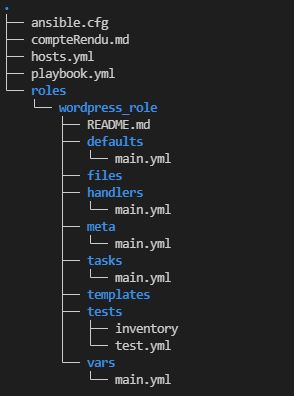
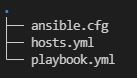
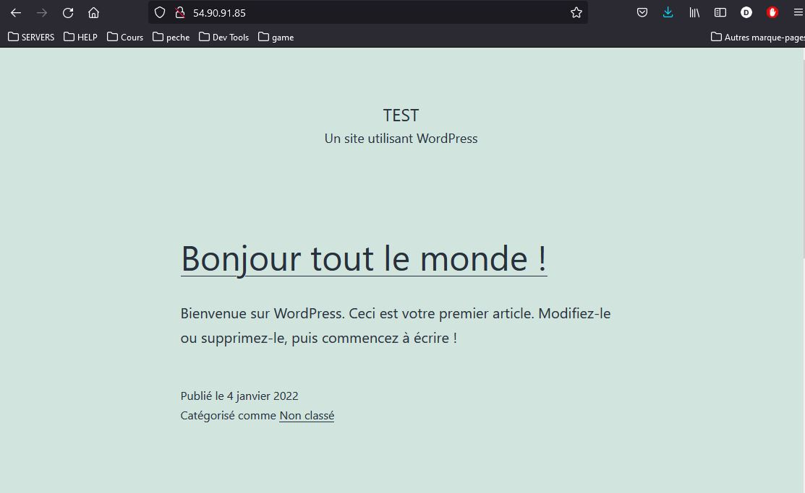
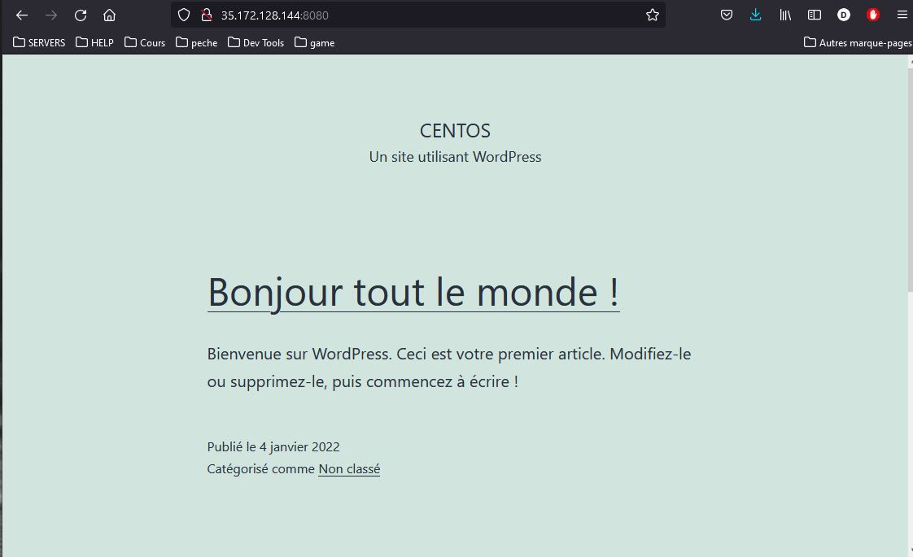

# COMPTE RENDU BENNANI Ansible wordpress Role
# Mise en place des taches pour le role
https://galaxy.ansible.com/omarpiotr/wordpress_role<br>
https://github.com/omarpiotr/wordpress_role
* Créer un réseau
* Créer un conteneur mysql
* Créer un conteneur Wordpress
* Ajouter les conteneurs au réseau crée

```yml
# création d'un projet de test mini_projet
mkdir -p mimi_projet/roles
cd mini_projet/roles
ansible-galaxy role init wordpress_role
```

#### ***`tasks/main.yml`***
```yml
---
# create network
- name: "Create a network"
  docker_network:
    name: "{{ network_name }}"

# run database
- name : "Launch mysql database container"
  docker_container:
    name: "{{ mysql_container }}"
    image: mysql:5.7
    ports:
      - "3306:3306"
    env:
      MYSQL_DATABASE: "{{ mysql_databse }}"
      MYSQL_USER: "{{ mysql_user }}"
      MYSQL_PASSWORD: "{{ mysql_password }}"
      MYSQL_RANDOM_ROOT_PASSWORD: "{{ mysql_root_password }}"
    volumes:
      - "{{ mysql_data }}:/var/lib/mysql"

# run wordpress
- name : "launch wordpress container"
  docker_container:
    name: "{{ wordpress_container }}"
    image: wordpress
    ports:
      - "80:80"
    env:
      WORDPRESS_DB_HOST: mysql_host
      WORDPRESS_DB_USER: "{{ mysql_user }}"
      WORDPRESS_DB_PASSWORD: "{{ mysql_password }}"
      WORDPRESS_DB_NAME: "{{ mysql_databse }}"
    links:
      - "{{ mysql_container }}: mysql_host"
    volumes:
      - "{{ wordpress_data }}:/var/www/html"

# add containers to network
- name: "Add a container to a network"
  docker_network:
    name: "{{ network_name }}"
    connected:
      - "{{ mysql_container }}"
      - "{{ wordpress_container }}"
    appends: yes
```
#### ***`default/main.yml`***
```yml
---
network_name: "wordpress" 
wordpress_container: "wordpress"
wordpress_port: 80
wordpress_data : "wordpress_data"
mysql_container: "mysql"
mysql_root_password: "root789!"
mysql_user: "wordpress"
mysql_password: "password789!"
mysql_databse: "db_wordpress"
mysql_data: "mysql_data"
```
## Consommer notre role crée avant de déposer sur github et Ansible Galaxy



* ansible.cfg
    * inventory par défaut
    * private_key_file
    * become=true
* hosts.yml
    * les hosts (centos/ubuntu) et leur configuration pour les tests
* Playbook.yml
    * Notre Playbook de test
    
#### ***`playbook.yml`***
```yml
---
- name: "deploy Wordpress with a role"
  hosts: prod
  roles:
    - wordpress_role
```
```bash 
ansible-playbook playbook.yml
```

# Consommer notre role Wordpress depuis la galaxy
```bash
# installation des roles
ansible-galaxy install omarpiotr.docker_role
ansible-galaxy install omarpiotr.wordpress_role

# creation d'un repertoire de tests:
mkdir mini_projet_galaxy
```


#### ***`ansible.cfg`***
```ini
[defaults]
inventory=./hosts.yml
private_key_file=/home/ubuntu/omar-kp-ajc.pem

[privilege_escalation]
become=true
```
* on va surcharger la variable **wordpress_port**
#### ***`hosts.yml`***
```yml
---
all:
  children:
    ansible:
      hosts:
        localhost:
          ansible_connection: local
          ansible_user: "ubuntu"
          hostname: AnsibleMaster
    prod:
      hosts:
        worker01: 
          ansible_host: 172.31.85.22
          hostname: AnsibleWorker01
          ansible_user: "ubuntu"
        worker02: 
          ansible_host: 172.31.90.97
          hostname: AnsibleWorker02
          ansible_user: "centos"          
          wordpress_port: 8080
      vars:
        env: "production"
        ansible_ssh_common_args: "-o StrictHostKeyChecking=no"
```
#### ***`playbook.yml`***
```yml
---
- name: "deploy Wordpress with a role"
  hosts: prod
  roles:
    - omarpiotr.docker_role
    - omarpiotr.wordpress_role
```

```bash
ansible-playbook playbook.yml
```
<br><br>

