# TP 1 : Script de démarrage + serveur Web

* virginie du nord
* 2 étiquettes
    * Name 
    * formateur

- créer la machine ubuntu
- lancer l'instance avec OS ubuntu et les bons caractérisques

```
Name : omar-ec2-webserver
formateur : Frazer
omar-sg-web
open web ports
```

```bash
#!/bin/bash
apt-get update -y
apt-get install nginx git -y
systemctl start nginx
systemctl enable nginx
git clone https://github.com/daviddias/static-webpage-example.git
rm -rf /var/www/html/*
mv static-webpage-example/src/* /var/www/html/
```


# TP 2 : Script de démarrage + Docker

```bash
#!/bin/bash
apt-get update -y
apt-get install curl -y
curl -fsSL https://get.docker.com -o get-docker.sh
sh get-docker.sh
usermod -aG docker ubuntu
systemctl start docker
systemctl enable docker
docker run -d -p 80:8080 pengbai/docker-supermario
```

# TP 3 : Script de démarrage + Docker + intranet

```bash
#!/bin/bash
apt-get update -y
apt-get install curl -y
curl -fsSL https://get.docker.com -o get-docker.sh
sh get-docker.sh
usermod -aG docker ubuntu
systemctl start docker
systemctl enable docker
docker run -d --name intranet  -p 80:8080 sadofrazer/ic-webapp:1.0
```

Se connecter sur la vm puis :
```bash
docker exec -it intranet cat /opt/releases.txt
docker exec intranet cat /opt/releases.txt
>AJC
>App Version 1.0
```

ACTION → PARAMETRE DE L'INSTANCE → MODIFIER LES DONNEE UTILISATEUR


# TP 4 : EBS + Snapshot

* Création d'un volume
    * Volume → Créer volume → (attention a la Zone de disponibilité ! ! !)
* Attacher ce volume à notre instance
    * Volumes → Attacher un volume → choisir l'instance

```bash
# rajouter le disque dans notre VM
ls /dev
# formatage du disque
sudo mkfs.ext3 /dev/xvdf
# on créer le dossier qui sera notre point de montage
sudo mkdir /mnt/data-store
df -h
# on monte le nouveau disque sur le dossier mnt/data-store
sudo mount /dev/xvdf /mnt/data-store
# copie du fichier dans ce disque
docker exec -t intranet cat /opt/releases.txt
sudo docker exec -t intranet cat /opt/releases.txt > releases-backup.txt
sudo cp releases-backup.txt  /mnt/data-store/releases-backup.txt
# copie d'un autre fichier
sudo sh -c "echo Omar toto test O_o > /mnt/data-store/toto.txt"
```
* Création d'un instantané
    *  Volume → selectionner volume → Créer un instantané de notre volume
* Simulation de la perte du Volume 
    * Volume → Forcer le détachement → (attendre) Supprimer le volume
* Création d'un volume a partir d'un instantané
    * Instantanés → selectionner l'instantané → Créer un volume a partir d'un instantané (attention a la Zone de disponibilité ! ! !)
* Attacher ce volume à notre instance
    * Volumes → Attacher un volume → choisir l'instance

```bash
# rajouter le disque dans notre VM
ls /dev
sudo mount /dev/xvdf /mnt/data-store
```
# Gestionnaire de cycle de vie
Permet d'automatiser la création de nos instantanés pour faire des sauvegarder périodiques

* Au préalable il faut ajouter une balise : Nom : test-omar pour notre instance

* Elastic Block Store → Gestionnaire de cycle de vie → Créer une stratégie de cycle de vie
* Stratégie des AMI basées sur des volumes EBS
* Spécifier les paramètres
    * Balise de ressource cible :
        * Volume / Instance
        * Nom : test-omar
    * descirption de la stragégie : save webapp instance
    * Rôle IAM : Rôle par défaut
    * Balises : Name / omar-backup-webapp-policy
* Status de la stragégie : Activé
* Redémarrage de l'instance : Non
* suivant (planification) :
    * Détail de la planification
        * Fréquence : Quotidien
        * Toutes les : 1h
        * Conserver 1 AMI
    * Paramètres avancés :
        * Cocher : Copier les balises a partir du volume source

# TP5 : Service S3 (bucket)
Dans la barre de recherche service tapper S3
* Créer un compartiement
    * Nom : omarpiotr-bucket-ajc
    * Liste ACL désactivée
    * Paramètres de blocages
        * décocher bloquer tous les accès publics 
        * cocher je suis conscient ...
    * Gestion des version : Désactiver
    * Balises :
        * Name : omar-bucket-ajc
        * formation : Frazer
    * Chiffrement par défaut : Désactiver
    * Paramètres avancés : Désactiver

* cliquer sur notre bucket
    * ajouter un fichier : Charger
    * Autorisation :
        * Liste de controle d'accès ACL
            * cliquer sur le lient propriétaire du compartiement appliqué
            * Liste ACL activées → enregistrer
    * Objet :
        * selectionné fichier → Action → Rendre public via la liste ACL

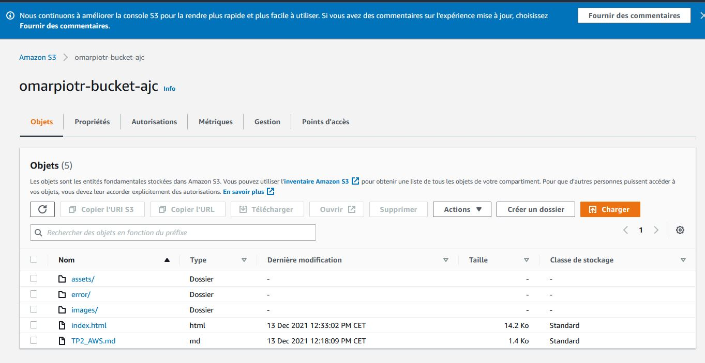

# TP6 : utiliser le bucket pour héberger un web-static
* Charger le site web
* Ajouter les autorisations pour tous les fichiers et dossier
* Aller sur la pages index.html pour récupérer l'URL de l'objet : https://omarpiotr-bucket-ajc.s3.amazonaws.com/index.html
* Propriété du bucket pour activer l'option d'hébergement de site static
    * Hébergement de site web statique : modifier
        * Activer
        * index.html
http://omarpiotr-bucket-ajc.s3-website-us-east-1.amazonaws.com


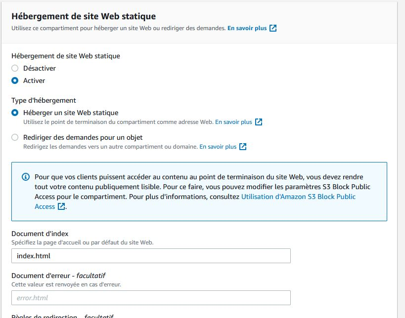


# TP7
```bash
#!/bin/bash
apt-get update -y
apt-get install curl -y
curl -fsSL https://get.docker.com -o get-docker.sh
sh get-docker.sh
usermod -aG docker ubuntu
systemctl start docker
systemctl enable docker
# creation d'un sous réseau
docker network create --subnet 192.168.40.0/24 --driver=bridge odoo
# postgre
docker run -d --network odoo --name db -e POSTGRES_USER=odoo -e POSTGRES_PASSWORD=odoo -e POSTGRES_DB=postgres postgres:13
# odoo
docker run -d -p 8082:8069 --name odoo --network odoo -e HOST=db -e PORT=5432 -e USER=odoo -e PASSWORD=odoo odoo
```

# TP8 : Virtual Private Cloud (VPC)

## Créer VPC avec des sous réseaux
* VPC → CLOUD PRIVE VIRTUEL → Adresses IP Elastic → Allouer l'adresse IP Elastic
    * Name : omar-eip-nat
    * formation : Frazer

* EC2 → notre zone → Adresse Ip Elastique → la récupérer 

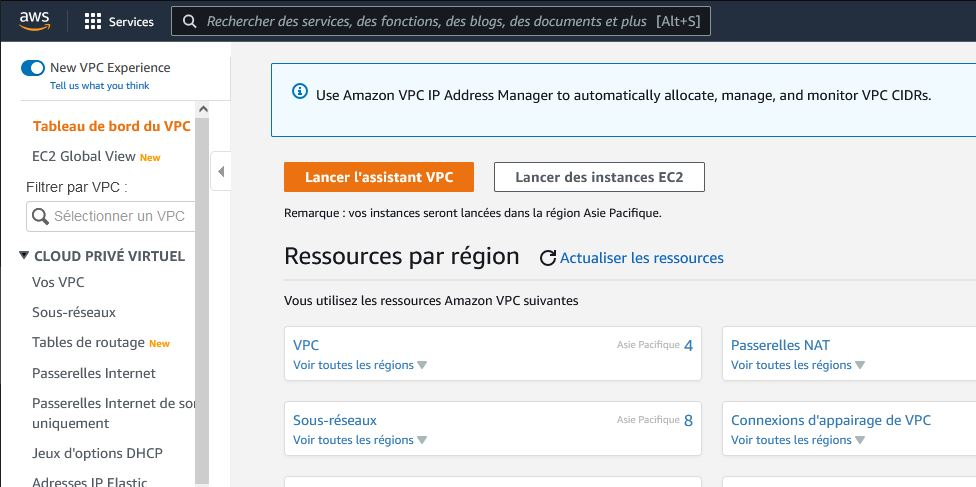
* VPC → Tableau du bord VPC → Lancer l'assistant VPC
    * VPC avec des sous réseaux public et privés (séléctionner)
    * configurer
        * VPC : omarpiotr-vpc
        * S/R public qui contiendra la NAT:
            * zone de disponibilité : séléctionner la notre
            * Nom du S/R : omarpiotr-public-subnet2a
        * S/R privé : 
            * zone de disponibilité : idem que celui du public
            * Nom du S/R : omarpiotr-private-subnet2a

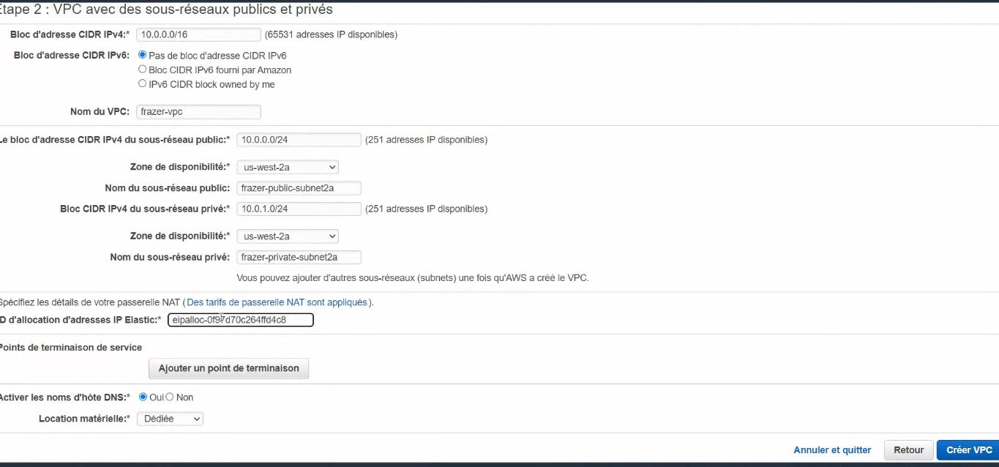

* VPC → CLOUD PRIVE VIRTUEL → Tables de Routage → filtrer par nom 
    * Choisir avec Routes : nat 
    * Associations de sous-réseau → Modifier les association de sous-réseau → cocher le sous réseau privé
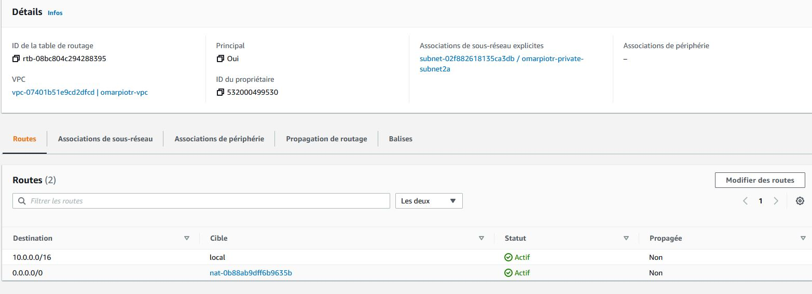
    * Choisir avec Routes : igw (cad internet getway qui sort sur le wan) 
    * Associations de sous-réseau → Modifier les association de sous-réseau → cocher le sous réseau public
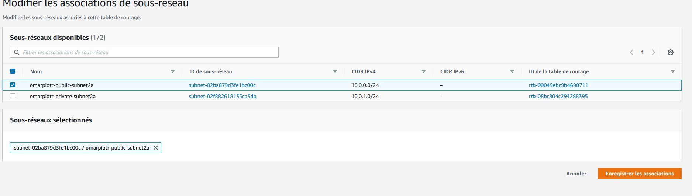

<br>

* EC2 → Créer un instance 1 :
    * Réseau : choisir notre VPC
    * Sous-réseau : spécifier le sous réseau privé !!
    * Attribuer automatiquement l'adresse IP publique : ACTIVER
    * sécurity groupe : 22/5432/8082
```bash
#!/bin/bash
curl -fsSL https://get.docker.com -o get-docker.sh
sh get-docker.sh
usermod -aG docker ubuntu
systemctl start docker
systemctl enable docker
docker run -d -p 5432:5432 -e POSTGRES_USER=odoo -e POSTGRES_PASSWORD=odoo -e POSTGRES_DB=postgres --name db postgres:13
```

* EC2 → Créer un instance 2 :
    * Réseau : choisir notre VPC
    * Sous-réseau : spécifier le sous réseau public !!
    * Attribuer automatiquement l'adresse IP publique : ACTIVER
    * sécurity groupe : 22/5432/8082
```bash
#!/bin/bash
curl -fsSL https://get.docker.com -o get-docker.sh
sh get-docker.sh
usermod -aG docker ubuntu
systemctl start docker
systemctl enable docker
docker run -p 8082:8069 --name odoo -e HOST=10.0.1.177 -e PORT=5432 -e USER=odoo -e PASSWORD=odoo  -d odoo
```

# TP 9 : ELB
* Groupe cible pour regroupper les différentes ressources
* On séléctionne les instances qui seront fédérées<br><br>
* VPC → Tableau du bord VPC → sous-réseaux :
    * Créer un sous réseau dans une zone de disponibilité différente
        * omarpiotr-public-subnet2b

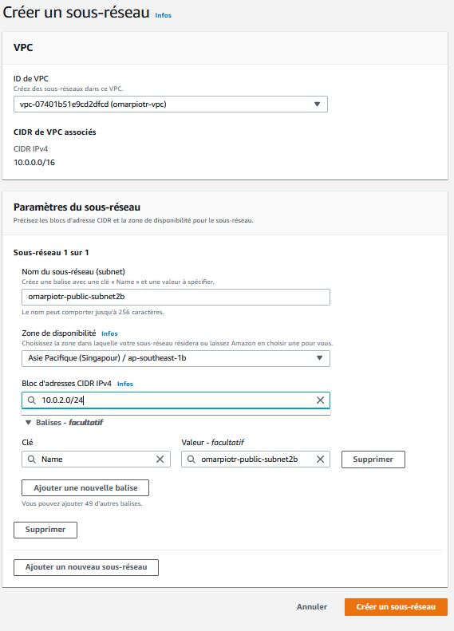

* VPC → Tableau du bord VPC → Tables de routage :
    * principale (non), celle qui a une igw → Association de sous-réseau → Modifier les  associations de sous-réseau : cocher/rajouter le nouveau sous réseau public
    


EC2 → Instance1 : omarpiotr-ec2-website01
```sh
#!/bin/bash
sudo apt-get update -y
sudo apt install nginx git -y
sudo systemctl enable nginx
sudo systemctl start nginx
sudo rm -Rf /var/www/html/*
sudo sh -c "echo Bonjour de la part de Omar > /var/www/html/index.html"
```

EC2 → Instance2: omarpiotr-ec2-website02
```sh
#!/bin/bash
sudo apt-get update -y
sudo apt install nginx git -y
sudo systemctl enable nginx
sudo systemctl start nginx
sudo rm -Rf /var/www/html/*
sudo sh -c "echo Bonjour de la part de AJC > /var/www/html/index.html"
```

EC2 → Equilibrage de charge → Groupe cibles
* créer un target groupe
    * instance
    * choisir son VPC
    * Name groupe :omarpiotr-elb-grp-web
    * TAG : omarpiotr-elb-grp-web
* selectionner les instance
* Include as pending below
→ Create target group

EC2 → Equilibrage de charge → Equilibreurs de charge → Créer un équilibreur de charge → ALB
* Basic configuration
    * omarpiotr-elb-web
    * internet-facing
* Network mapping
    * VPC choisir son vpc
    * Mapping

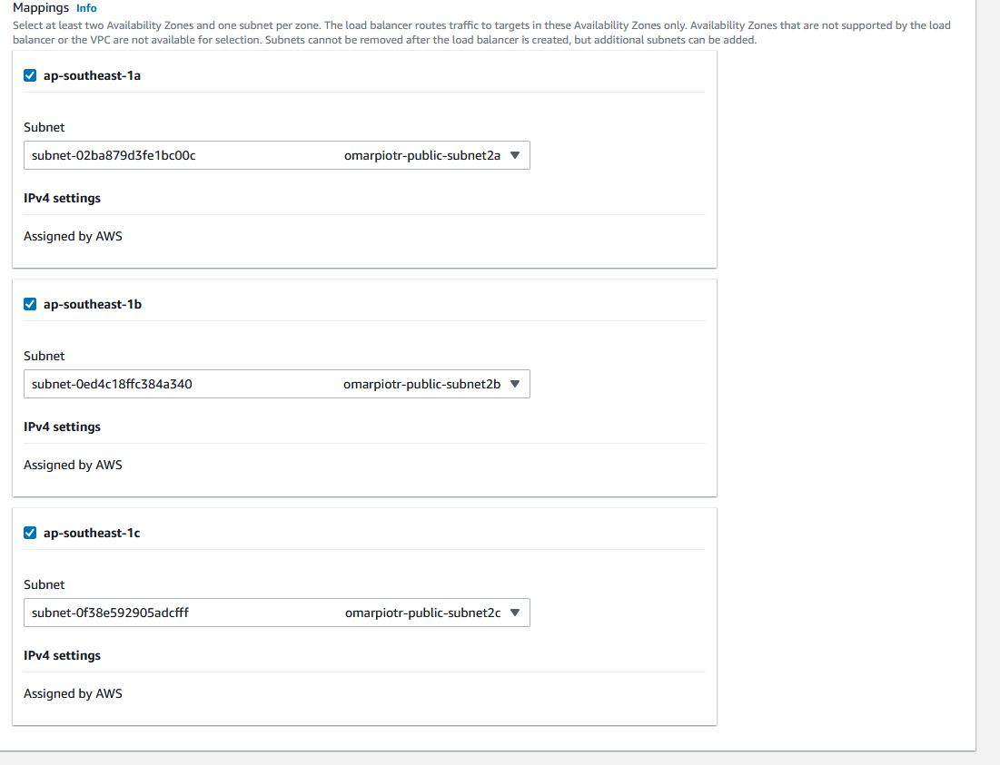
* Security group
    * choisir son sécurité group
* Target group
    * omarpiotr-elb-grp-web
* Tags 
    * Name : omarpiotr-elb-web
    * formation : Frazer

# TP 10 Autoscaling Scaling Group (ASG)
## Résumé / principe

* Evolutive en cas de montée en charge → créer une instance supplémentaire
* Créer une configuration de lancement (spécifier les paramètres à AWS pour créer d'autres instances) : Template
    * AMI
    * Caractéristique (T2Micro / SG )
* ASG associé à la configuration de lancement
    * Ressources à créer: Nbre de ressoures minimal / Nbre de ressources souhaité / Nbr de ressources Max
    * Politique de suivi (optionnel) : sur CPU (70% dt alors créer new instance) / sur Traffic
## Vocabulaire:

* Scaling In : récupère la ressources précédement créée
* Scaling Out : Créer une nouvelle ressource

## TP


### Création d'une Image :
* Créer une instance EC2
* A partir de cette instance on va créer une image AMI

### Créer une configuration de lancement :
[ EC2 ] → Auto Scaling → Configuration de lancement
* créer une configuration de lancement
* omar cgf-asg-web
* selectionner notre AMI
* Type d'instance t3.micro / t2.micro
* Détails avancé :
    * laissé les paramétres par défaut
    * Type d'adresse IP : Attribuer une @ IP à chaque instance
* Groupe de sécurité Existant : 
    * le même qu'on a choisi
* Spécifier la Key Paire

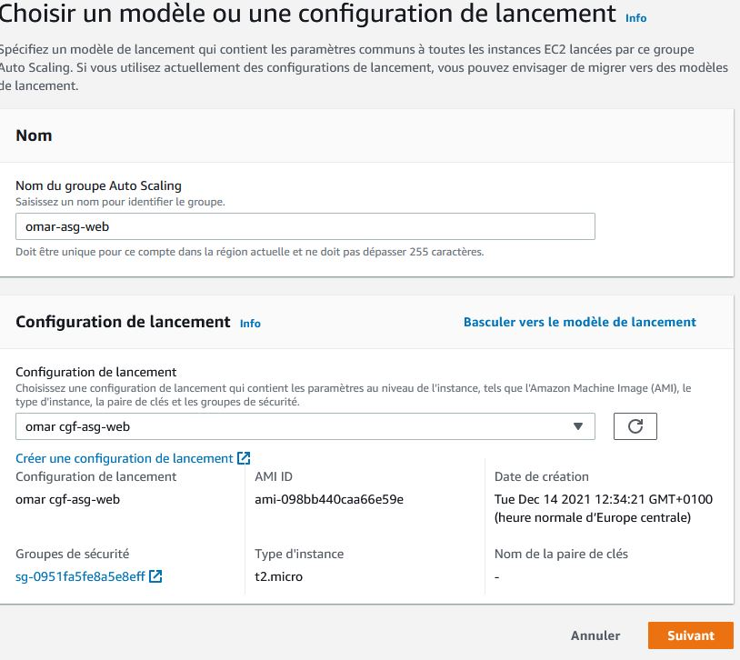


### Groupe-Auto-Scaling
[ EC2 ] → Auto Scaling → Groupe Auto Scaling
* Créer un groupe d'auto-scaling
* etape1
    * omar-asg-web
    * Modèle de lancement → Basculer vers la configuration de lancement
        * celle que l'on a créer → suivant
* étape2 
    * choisir notre VPC
    * zone de disponibilité (prendre les deux sous-réseaux publics)

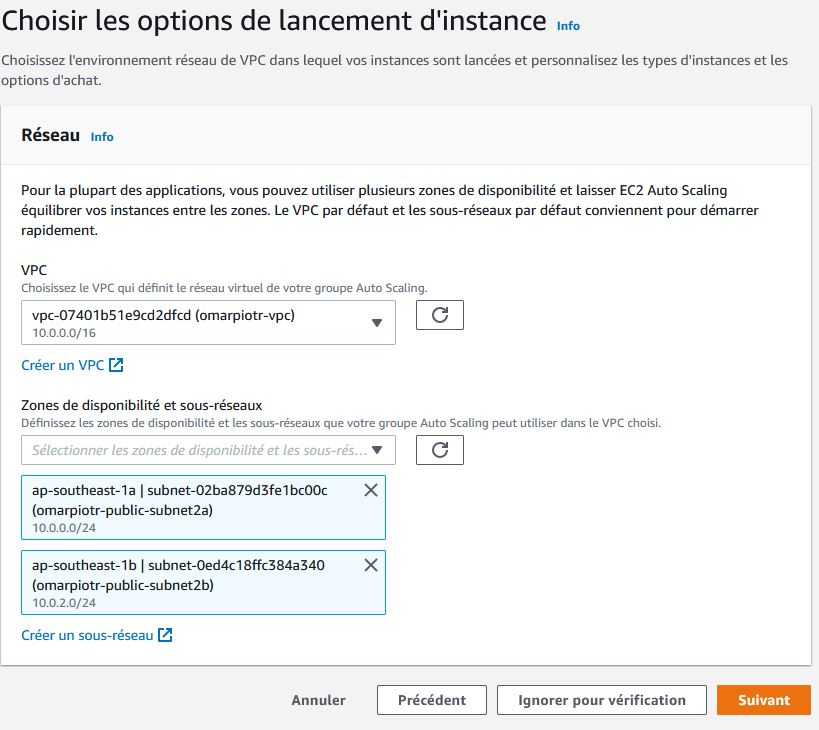

* étape 3 
    * Attacher à un nouvel equilibreur de charge
    * Application load Balancer
    * Interfnet-facing
    * vérifier que notre VPC et bien séléctionné
    * Créer un groupe cible (il va générer un nouveau groupe)
    * cocher ELB / 300 sec

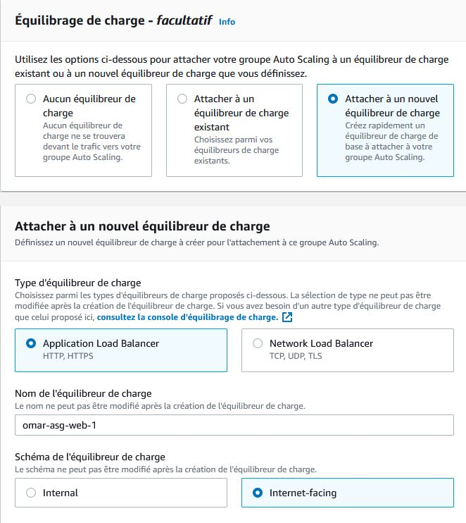<br>
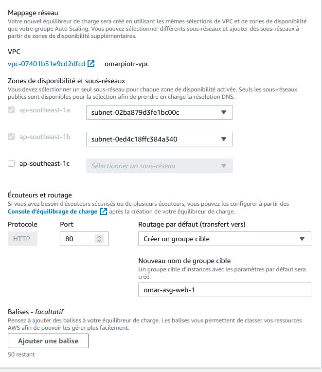<br>
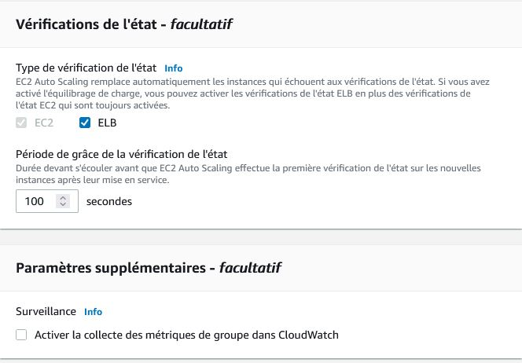

* etape 4
    * capacité souhaitée 2
    * capacité minimale 1
    * capacité maximal 3
    * stratégie de mise a l'échelle avec suivi de la cible
        * Target Tracing Policy
        * Type de métrique : Utilisation moyenne de la CPU
        * valeur cible : 70
        * besoin d'instance : 100 sec
    
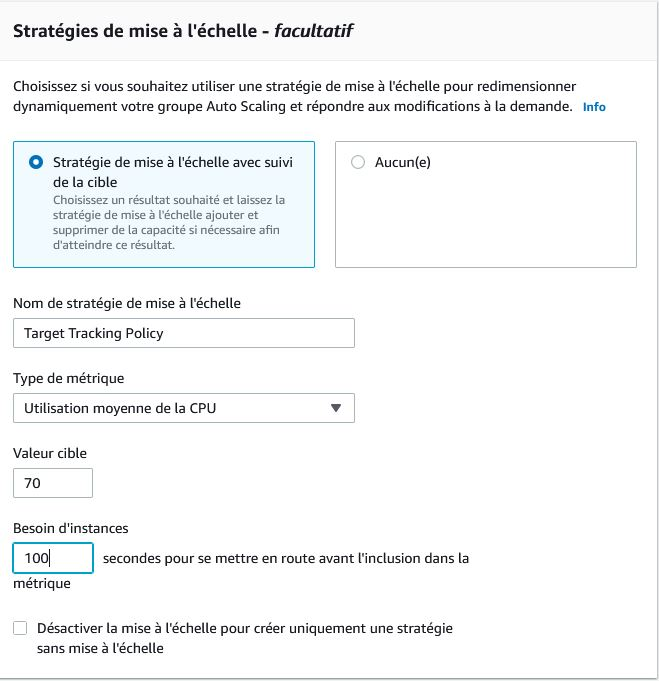

* etape 5
    * suivant ne rien faire
* etape 6 (balises pour les machines qui seront créées)
    * Name : omar-ec2-asg-web
    * formation : Frazer
 * etape 7 : résumé → créer un groupe d'Auto Scaling

 ### Se rendre dans EC2 instance pour voir les instances crées
 * A l'initialisation on a 2 asg

 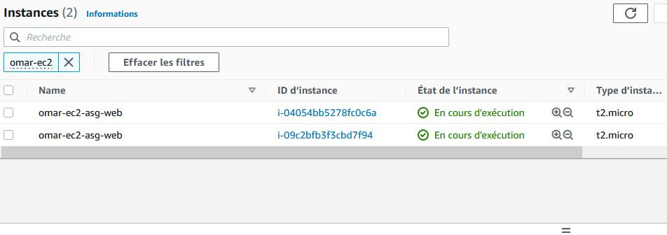
 
 * au bout de 100 sec il ne restera plus qu'une seule instance

 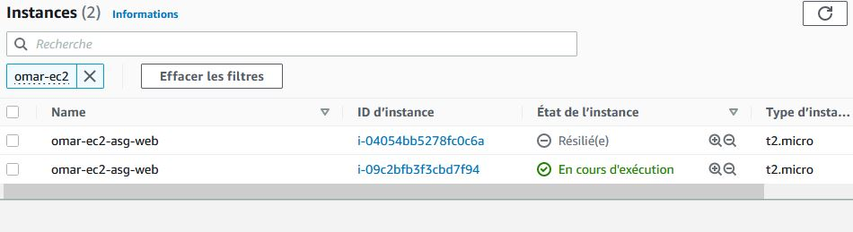
 
 * L'équilibreur de charge contient l'adresse IP publique (à fournir au client)

 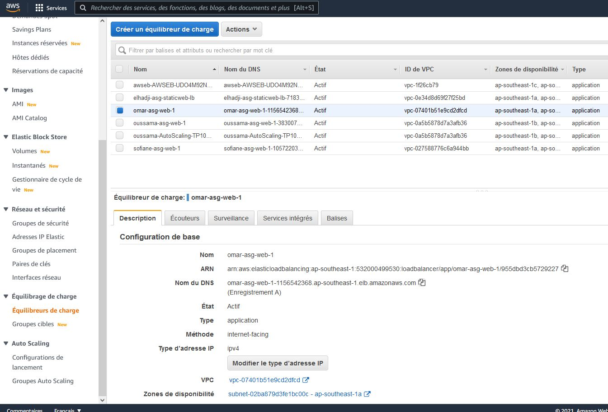
 

# TP 11 ASG et ELB (Todo)
...

# TP 12 Elastic Contenaire Service (ECS)

## Création d'un cluster (par le formateur)

[ ECS ] → Cluster
* on va TOUS utiliser le mm cluster
* Créer un cluster
    * Mise en réseau uniquement (Farget)
    * Nom du Cluster : ajc-formation
    * (NE PAS créer de VPC ! ! )
    * Tag | Name : ajc-formation / formation : Frazer
* Entrer dans notre cluster
    * Taches → Exéctuer une taches (spécifier les contneur)

## Création d'une tache

[ ECS ] → Définition de taches → Créer une définition de Tache
* FARGATE
* Nom : omar-bdd-odoo
* Rôle de tâche : - 
* Mode réseau : awspc (default)
* OS : Linux 
* Rôle d'execution de tâche : escTaskExecutionRole  (default)
* Mémoire : 2Go
* Processeur 1vCPU
* Ajouter un conteneur
    * Nom du conteneur : omar-postgres
    * Image : postgres
    * Mappages de ports : 5432 (port exposé par le conteneur)
    * ...
    * Variables d'environnement
        * POSTGRES_USER : odoo
        * POSTGRES_PASSWORD : odoo
        * POSTGRES_DB : postgres
* Ajouter un deuxieme conteneur    
    * Nom du conteneur : omar-odoo
    * Image : odoo
    * Mappages de ports : 8069 (port exposé par le conteneur)
    * ...
    * Variables d'environnement
        * HOST : 127.0.0.1
        * PORT : 5432
        * USER : odoo
        * PASSWORD : odoo 
    * STARTUP DEPENDANCY
        * omar-postgre : START
* → Créer notre TACHE

## Execution de la tâche
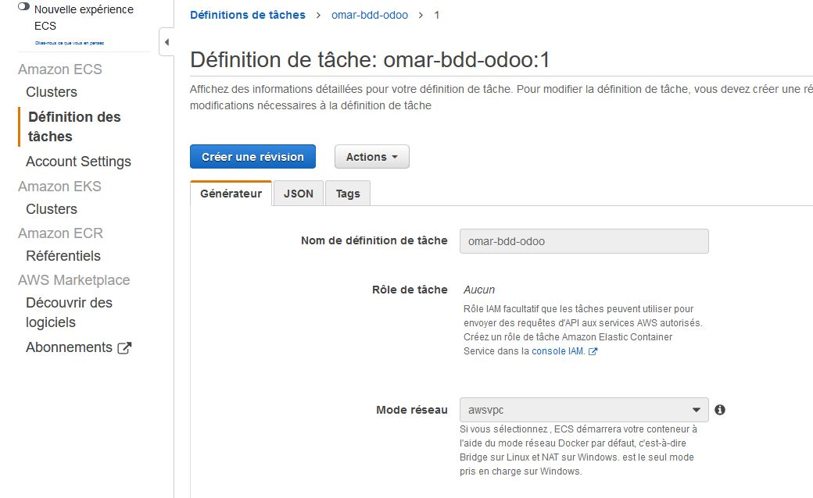<br>

[ ECS ] → (choisir sa tache) → (choisir sa tache) → bouton [Action] → Executer la tache
* Type :  Farget
* OS : linux
* Cluster : ajc-formation
* VPC : choisir le VPC par défaut 172.31.0.0
* sous réseau : 1a/1d/1c
* modifier groupe de sécurité
    * AJouter le PostGre : 5432
    * TCP personalisé : 8069
    * Enregistrer
* Attribuer automatiquement IP publique : ENABLED
* TAGS : formation Frazer
* Executer la tâche

Cliquer sur la tache pour avoir 
* l'@IP publique
* @IP interne 172.31.18.63

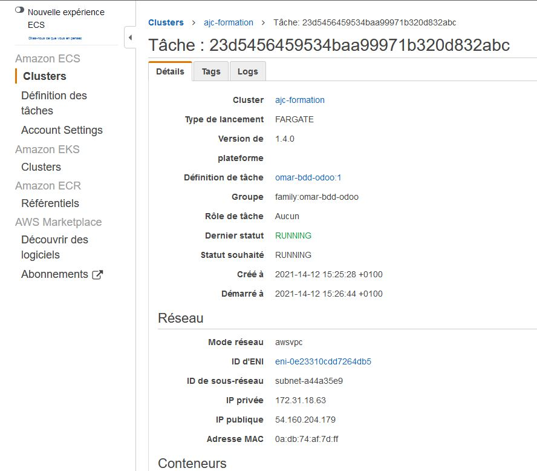

## Création d'un EC2 avec un conteneur docker et odoo qui communiquera avec la db postgres

[ EC2 ] → Instances → Créer une instance sur laquelle il faut déployer un conteneur odoo
```bash
#!/bin/bash
curl -fsSL https://get.docker.com -o get-docker.sh
sh get-docker.sh
sudo usermod -aG docker ubuntu
sudo docker run -p 8082:8069 --name odoo -e HOST=172.31.18.63 -e PORT=5432 -e USER=odoo -e PASSWORD=odoo -d odoo
```

# TP 13 : code Commit
## codeCommit

[ CodeCommit ] → Créer un référentiel<br>
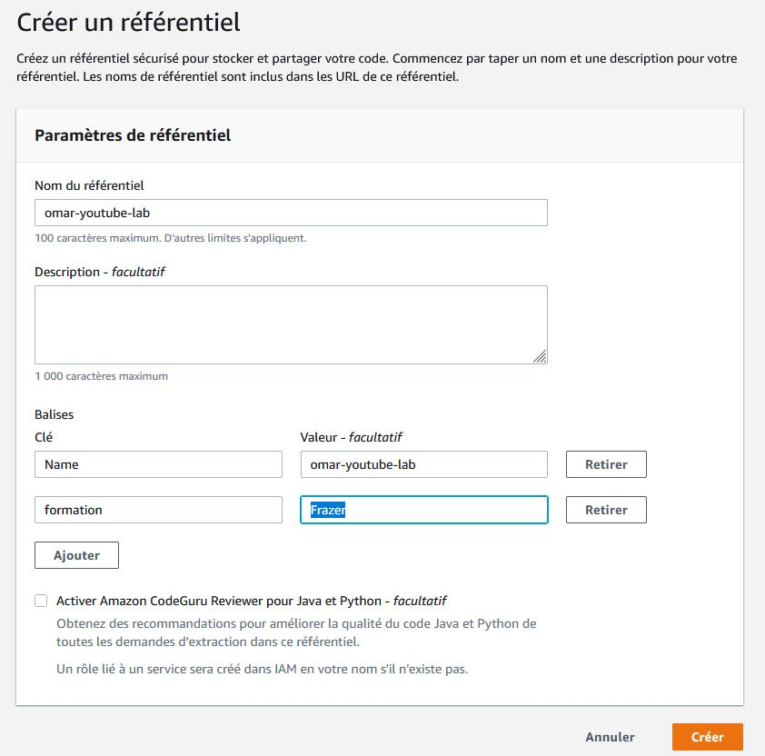
* URL du clone
    * https://git-codecommit.us-east-1.amazonaws.com/v1/repos/omar-youtube-lab
    * ssh://git-codecommit.us-east-1.amazonaws.com/v1/repos/omar-youtube-lab


## IAM pour récupérer les droits utilisateur et spécifier la clé

[ IAM ] → utilisateurs → Capge → Informations d'identification de sécurité
* Clé SSH pour Code Commit 
    * Télécharge clé publique SSH
* Informations d'identification Git HTTPS pour AWS CodeCommit (2 utilisateurs max)
    * Générer des information d'identification
        * ID: capge-at-532000xxx
        * Mot de passe : **********


## Sur notre machine cloner le projet et faire un commit

```bash
git clone https://git-codecommit.us-east-1.amazonaws.com/v1/repos/omar-youtube-lab
# Copie le contenue https://github.com/sadofrazer/youtube-lab-example
git add .
git commit -m "First commit and add application on aws"
# vérifier que l'on pointe bien ver notre reposytory aws
git remote -v
git push origin master
```

# TP 14 : service code build
## Créer et récupérer un token depuis DockerHub

Account Settings → Secrity → Access Tokens → New Access Token

## Sauvegardé le Token de DockerHub dans un Secret

[ Secrete manager ] → Secrets  → Stocker un nouveau secret : omarpiotr_dockerhub_login
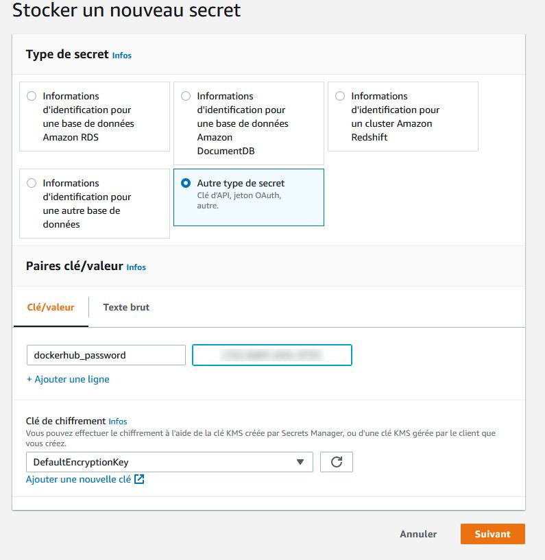<br>
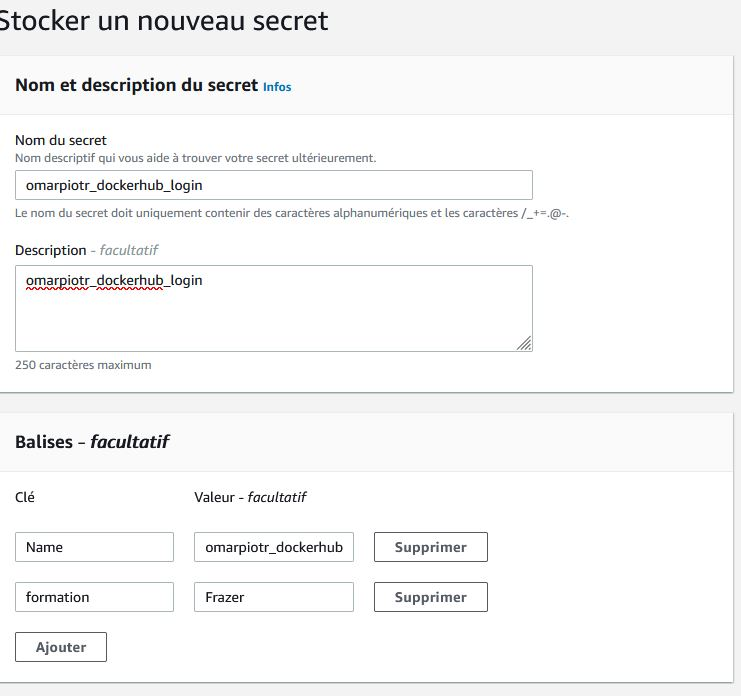<br>
Suivant → Suivant → Stocker<br>
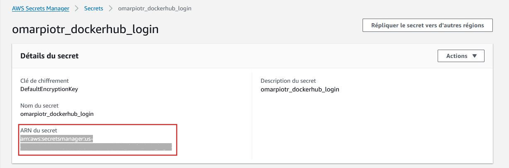<br>
* Récupérer ARN, on l'utilisera par la suite pour créer la statégie

## Ajouter le fichier BuildSpec: 

[ CodeCommit ] → Référentiels → omar-youtube-lab 
* Ajouter le fichier suivant : buildspec.yml
```yml
version: 0.2
env:
  secrets-manager:
    DOCKERHUB_PASSWORD: "omarpiotr_dockerhub_login:dockerhub_password"
  variables:
    DOCKERHUB_LOGIN: omarpiotrdeveloper
    IMAGE_REPO_NAME: youtube-lab
    IMAGE_TAG: 2.0
    
phases:
  pre_build:
    commands:
      - echo Log in DockerHub...
      - docker login -u $DOCKERHUB_LOGIN -p $DOCKERHUB_PASSWORD
  build:
    commands:
      - echo Build started on `date`
      - echo Building the Docker image...          
      - docker build -t $DOCKERHUB_LOGIN/$IMAGE_REPO_NAME:$IMAGE_TAG .
      - docker run --name test -d -p 80:80 $DOCKERHUB_LOGIN/$IMAGE_REPO_NAME:$IMAGE_TAG
      - sleep 5
      - |
        if $(curl http://localhost | grep -iq "Youtube");
        then
          echo image seems to be working normally
        else
          echo image is not working as expected
          echo we delete the image to ensure that the image will not be pushed
          docker rmi $DOCKERHUB_LOGIN/$IMAGE_REPO_NAME:$IMAGE_TAG
        fi
  post_build:
    commands:
      - echo Build completed on `date`
      - echo Pushing the Docker image...
      - docker push $DOCKERHUB_LOGIN/$IMAGE_REPO_NAME:$IMAGE_TAG
```
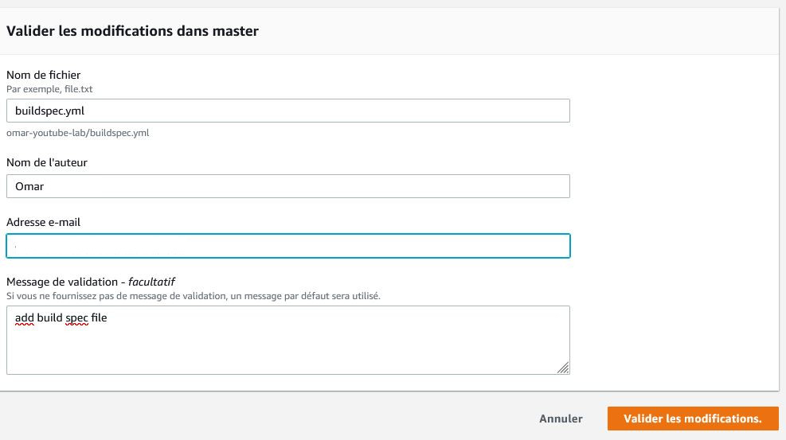

## Créer un projet de génération

[ CodeBuild ] →  Créer un projet de génération : omar-build-youtube-lab<br>

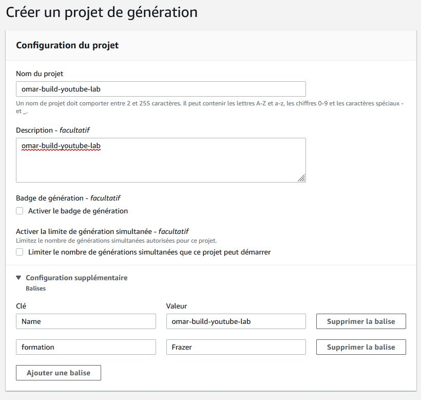<br>
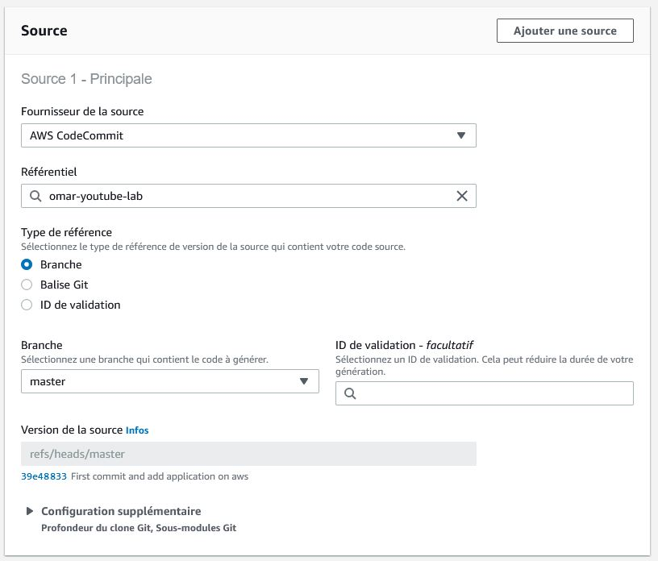<br>
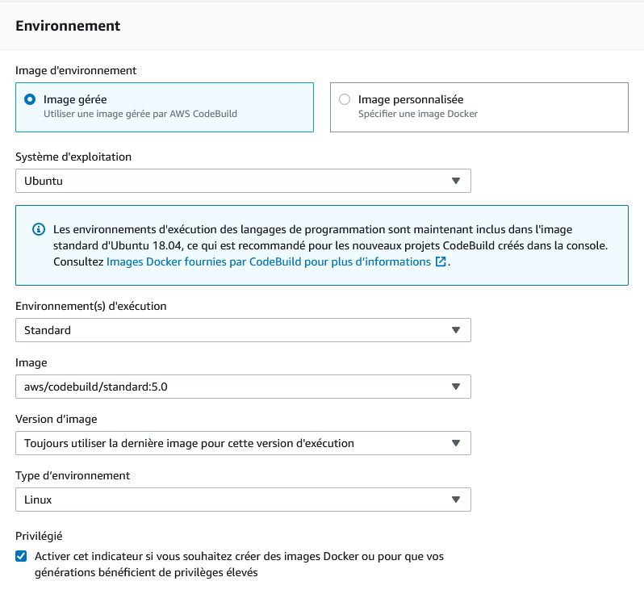<br>
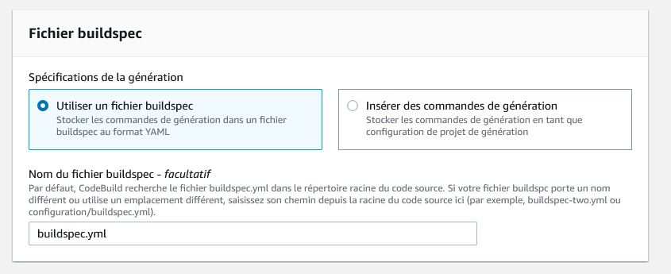<br>
* Rôle de service
    * Nouveau rôle de service
* Nom du rôle (généré automatiquement):
    * codebuild-omar-build-youtube-lab-service-role

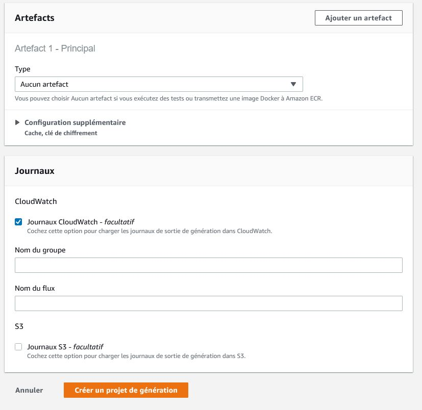<br>

* La génération de notre build va échoué car on a pas les privilèges

## Ajouter les privilège car on a pas les droits

[ IAM ] → ROLE → selectionner notre role : codebuild-omar-build-youtube-lab-service-role<br>
[ IAM ] → Créer une stratégie
* Choisir un service: secret manager
    * cocher lire
* ressources concerné par la stratégie : spécifique
* Secret : Ajouter un ARN : arn:aws:secretsmanager:us-east-1:532000xxxxxxxxxxxxxxxxxxxxxxxxxxxxxxxxxxM
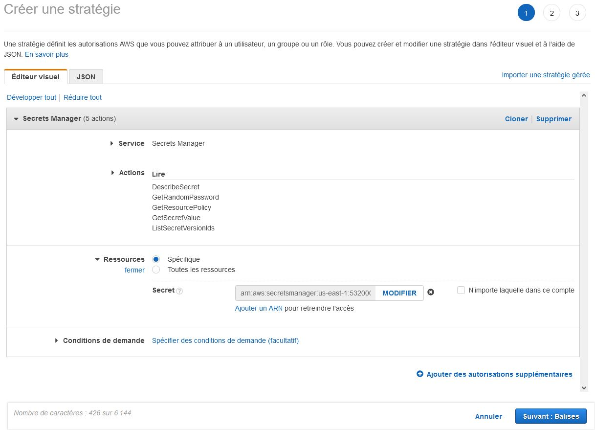<br>
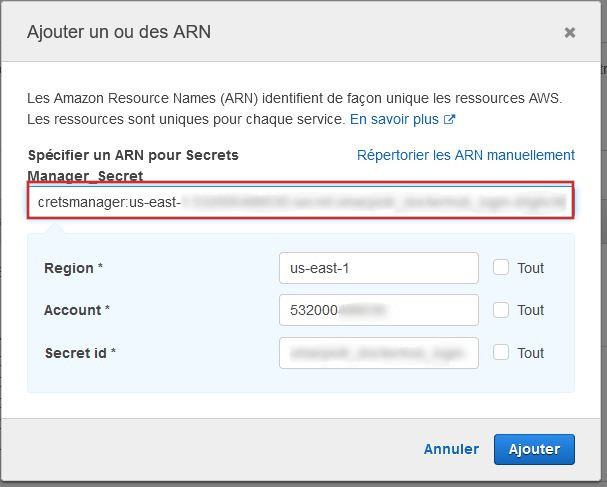<br>
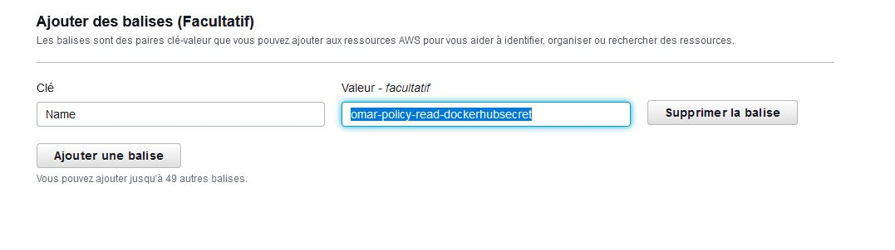<br>
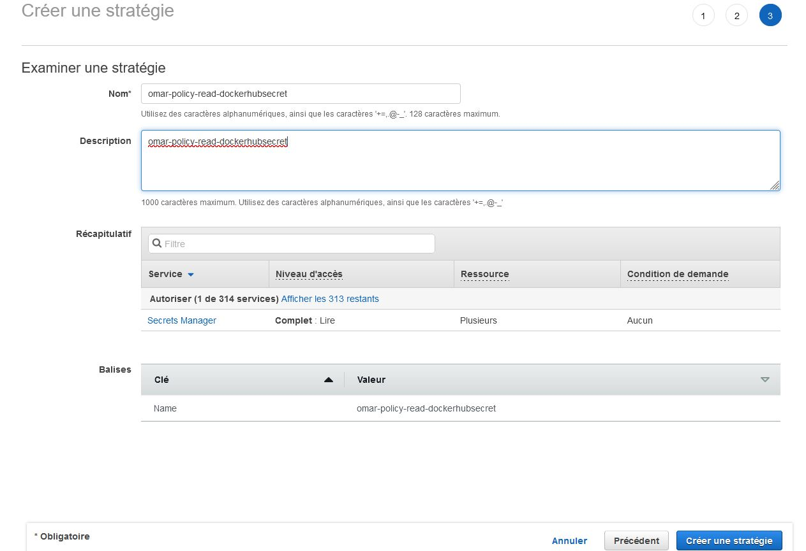<br>

[ IAM ] → ROLE → selectionner notre role : codebuild-omar-build-youtube-lab-service-role<br>
* Autorisation → Attacher des stratégies → Selectionner la stratégie précédement crée → Attacher une stratégie
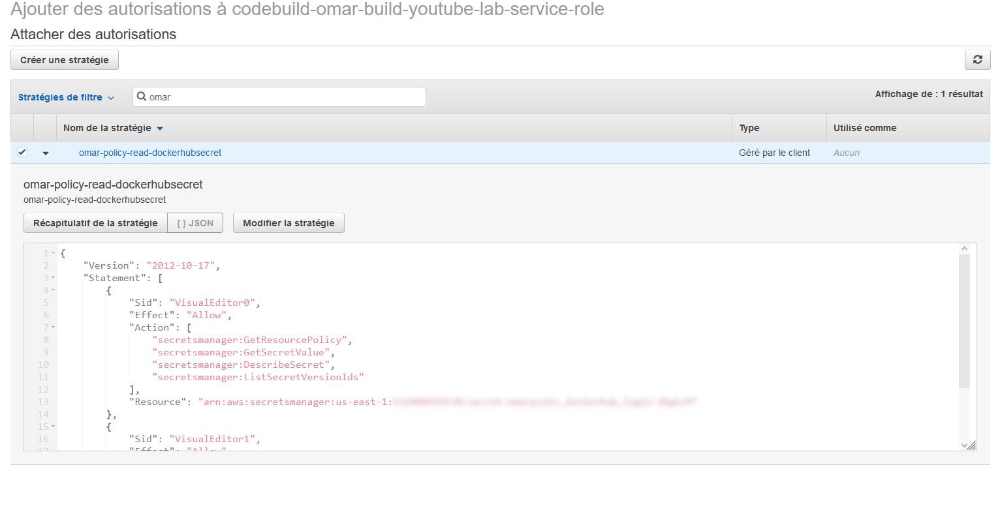<br>
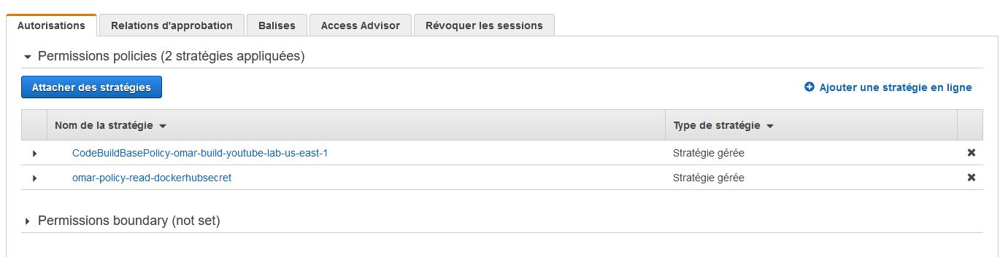<br>

## On rebuild notre code à nouveau

[ CodeBuild ] → Projet de génération → OK <br>

## Mise en place d'un Pipline CI (automatique)

[ CodeBuild ] → Pipeline → créer un pipeline → créer un nouveau role<br>

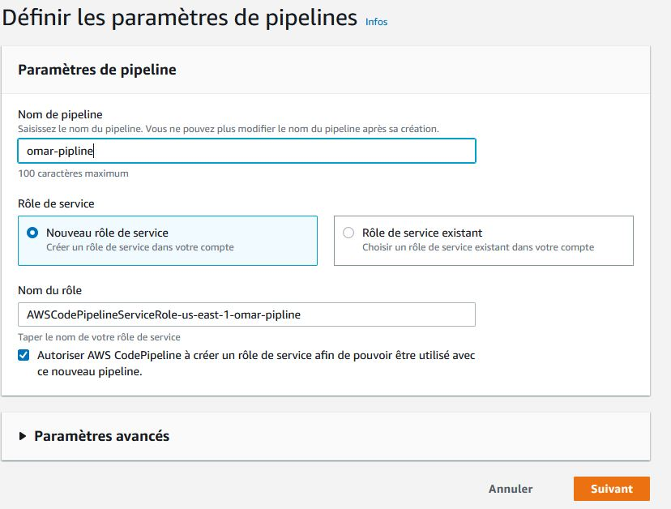<br>

<br>

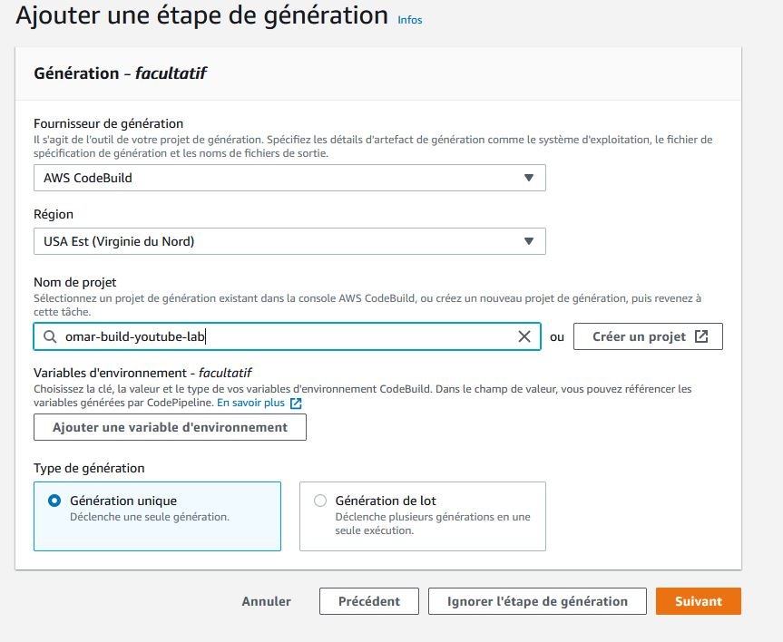<br>

* etape 4 ignorer

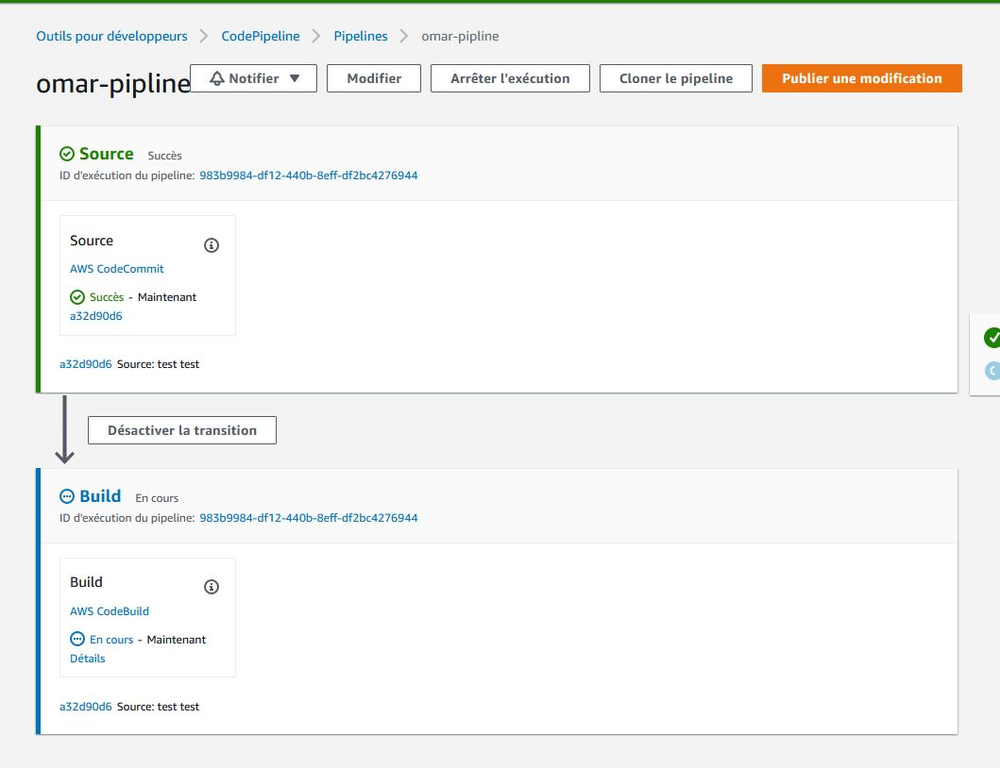<br>
