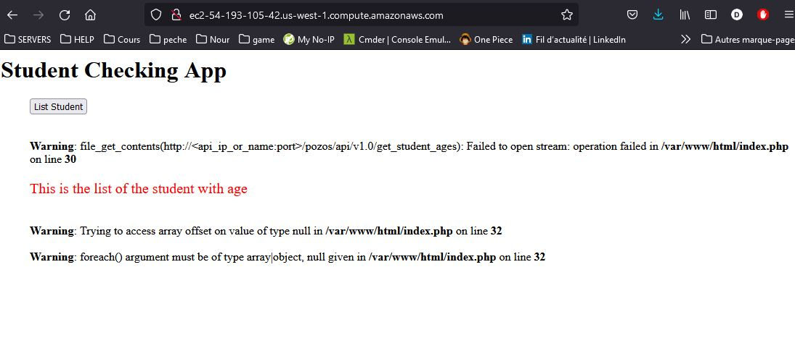
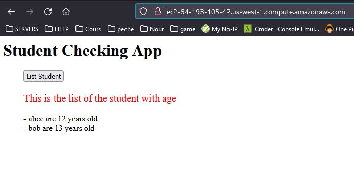
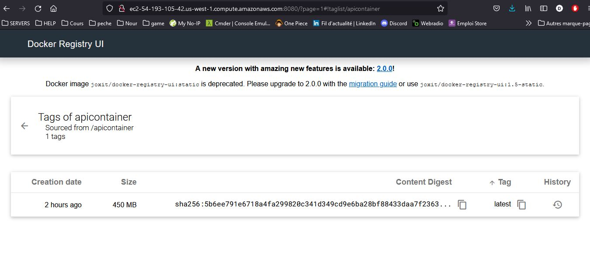

# TP01 : Installation de Docker
```Bash
# installation
curl -fsSL https://get.docker.com -o get-docker.sh
sh get-docker.sh
sudo usermod -aG docker centos
sudo systemctl start docker
sudo systemctl enable docker

# informations
docker --version
docker version
docker info

# lancer un conteneur image:tag (si pas de tag il prend latest)
docker run hello-world:latest

# lancer un conteneur portant le nom omar avec l'image hello-world
docker run --name omar hello-world

# par défaut un conteneur s'exécuter dans un sous réseau (de docker)

# lancer un conteneur "some-nginx" de l'image nginx, -d : détaché
docker run --name some-nginx -d nginx

# exécuter une commande (ls /) sur le conteneur some-nginx, -it (i= interactif ; t= terminal tty) 
docker exec -it some-nginx ls /

# entrer dans un bash intéractif
docker exec -it some-nginx bash

# Exposition du port externe: -p 8000:80 > effectuer une redirection du port 8000 de notre host vers le port 80 du conteneur , d déporté
docker run --name some-nginx-2 -d -p 8000:80 nginx

# Télécharger une image
docker pull kodekloud/webapp-color:latest

# Spécifier une variable d'environnement
docker run -d --name webserver-red -p 80:8080 -e APP_COLOR='red' kodekloud/webapp-color
docker run -d --name webserver-blue -p 8080:8080 -e APP_COLOR='blue' kodekloud/webapp-color

# affiche uniquement les ID conteneurs
docker ps -aq

# supression de tous les conteneurs (ne pas faire en production)
docker rm -f $(docker ps -aq)

# afficher les ID des images
docker rmi -f $(docker images -aq)

# les deux a la fois 
docker rm -f $(docker ps -aq) && docker rmi -f $(docker images -aq)
```

---

# TP02 : Build et push de l'image
## Version 1 : Création d'une image avec contenu en local
```Bash
# installer git sur la machine locale
sudo yum install git -y

## CREATION D'UNE IMAGE
# créer un repertoire webapp
mkdir webapp && cd webapp

# y télécharger le code source depuis le git
git clone https://github.com/diranetafen/static-website-example

# créer un fichier Dockerfile dans
vi Dockerfile
```
```Dockerfile
FROM ubuntu
LABEL omar Piotr Developer
RUN apt-get update -y
RUN apt-get install nginx -y
ADD static-website-example/ /var/www/html
EXPOSE 80
ENTRYPOINT ["/usr/sbin/nginx", "-g", "daemon off;"]
```
```Bash
# créer/build de mon image
docker build -t webapp:v1 .

# Modifier le Tag de cette image (il faut récupérer l'id de l'image webapp:v1)
docker tag e3c06c4aaa27 omarpiotrdeveloper/webapp:v1
```
## Version 2 : Création d'une image en intégrant le clone git dans le dockerfile
```Dockerfile
FROM ubuntu
LABEL omar Piotr Developer
RUN apt-get update
RUN DEBIAN_FRONTEND=noninteractiv apt-get install nginx git -y
# vide le repertoire html car git a besoin d'un rep vide + variable
RUN rm -rf /var/www/html/*
RUN git clone https://github.com/diranetafen/static-website-example/ /var/www/html/
# desinstaller git
RUN apt-get remove git -y
EXPOSE 80
ENTRYPOINT ["/usr/sbin/nginx", "-g", "daemon off;"]
```
```Bash
# creation de l'image
docker build -t omarpiotrdeveloper/webapp:v3 .
```

## Version 3 : Création d'une image à partir d'un conteneur existant
```bash
# Faire un snapshot d'un conteneur pour en faire une image 
docker commit nginxomar

# Récupérer d'id de l'image afin de renommer l'image
docker images

# Renomer l'image (ici omarpiotrdeveloper = ID utilisateur dans Docker Hub)
docker tag 2bab96ef5af0 omarpiotrdeveloper/webapp:v2 
```

## Déployer une image sur le Docker Hub
```bash
# se logger et entrer login et mdp (omarpiotrdeveloper)
docker login

# Modifier les Nom et Tag de l'image pour qu'il soit USERID/image:version
docker tag e3c06c4aaa27 omarpiotrdeveloper/webapp:v1
# ou
docker tag webapp:v1 omarpiotrdeveloper/webapp:v1

# Déployer
docker push omarpiotrdeveloper/webapp:v1
```
# TP03 : Gestion des réseaux 

## Exercice 1
Différents types de réseau
* None (aucun réseau)
* Bridge (par défaut, les conteneur est dans un sous-réseau virtuel accessible avec les règles -p 80:80)
* Host (le conteneur à accès directement aux interfaces réseau)
* Overley (tunnel transversal pour deux conteneurs se trouvant sur 2 machines différentes)
* MacVlan (le conteneur obtient une configuration ip directement depuis le routeur comme si ct une machine)
```bash
# création d'un nouveau réseau
docker network create --subnet 192.168.10.0/24 --driver=bridge my_first_network
docker network create --subnet 192.168.20.0/24 --driver=bridge sharenetwork

# création de conteneur sur ces réseaux spécifique
docker run -d -it --name centos1 --network sharenetwork centos bash
docker run -d -it --name centos2 --network sharenetwork centos bash
docker run -d -it --name centos3 --network host centos bash
# ici j'écrase l'ENTRYPOINT par défaut par la commande bash

# puis j'inspect le réseau : 
# - information sur le réseau 
# - les machines qui y sont connecté et leur @IP
docker inspect sharenetwork
docker inspect my_first_network

# On peu aussi inspécter un conteneur
docker inspect centos3

# se connecter sur la machine centos1 en commande
docker exec -it centos1 bash

# faire un ping depuis cette machine (centos01)
ping centos2

# créer une machine qui est sur le 3ieme réseau
docker run -d -it --name centos3 --network my_first_network centos
# elle ne voit pas les autres machies de ce réseau

# récupérer les logs d'un conteneur
# f : suivre en permanence les logs | t : afficher l'heure de récéption des log
docker logs -ft nom_de_mon_conteneur
```
## Exercice 2

```bash
# création du réseau 
docker network create --driver bridge wordpress

# création des deux conteneurs sur le network wordpress
docker run -d --network wordpress --name mysql \
	-e MYSQL_ROOT_PASSWORD=root -e MYSQL_USER=toto -e MYSQL_PASSWORD=toto -e MYSQL_DATABASE=wordpress \
	mysql:5.7
docker run -d --network wordpress --name wordpress -p 8080:80 \
	-e WORDPRESS_DB_HOST=mysql -e WORDPRESS_DB_NAME=wordpress -e WORDPRESS_DB_USER=toto -e WORDPRESS_DB_PASSWORD=toto \
	wordpress

# tagger les images puis les envoyers sur le Registry
docker tag wordpress omarpiotrdeveloper/wordpress
docker tag mysql:5.7 omarpiotrdeveloper/mysql:5.7
docker push omarpiotrdeveloper/wordpress
docker push omarpiotrdeveloper/mysql:5.7
```

# TP04 : Gestion des volumes
* Volume : stocké dans la Docker Areat /var/lib/docker/Volume (droits root uniquement) exemple database
* Bind Mount : stocké localement , on y a tous les droits exemple contenur d'un site web

## Exercice 1
```bash
# création d'un Volume
docker volume create share
docker volume ls

# les 2 machines vont partager le même Volume qui sera monté dans le rep temp des conteneurs
docker run -d -it --name centos1 -v share:/tmp centos bash
docker run -d -it --name centos2 -v share:/tmp centos bash

# j'ajouter un fichier dans le tmp depuis le conteneur 1
docker exec -it centos1 bash
echo Bonjour omar > /tmp/toto.txt
cat /tmp/toto.txt

# j'ajoute des données au fichier précédent depuis le conteneur 2
docker exec -it centos2 bash
echo Bonjour depuis le conteneur 2 >> /tmp/toto.txt

docker run -d -it --name centos3 --hostname centosc -v share:/tmp centos bash
docker exec -it centos3 bash

git clone https://github.com/diranetafen/static-website-example.git
docker run --name webserver -p 80:80 -d -v ${PWD}/static-website-example/:/usr/local/apache2/htdocs/ httpd

docker rm -f $(docker ps -aq)

# supprimer les volumes qui ne sont pas utilisés
docker volume prune
```

## Exercice 2
```bash
docker network create --driver bridge odoo

# télécharge les images
docker pull postgres:10
docker pull odoo:12.0

docker run -d --network odoo --name postregresdb \
	-e POSTGRES_PASSWORD=pass -e POSTGRES_USER=toto -e POSTGRES_DB=postgres \
	-v pgdata:/var/lib/postgresql/data \
	postgres:10

docker run -d --network odoo --name odoo -p 8069:8069 \
	-e USER=toto -e PASSWORD=pass -e HOST=postregresdb \
	-v ${PWD}/config:/etc/odoo -v ${PWD}/addons:/mnt/extra-addons -v odoo-web-data:/var/lib/odoo \
	odoo:12.0
```

# TP5 : docker-compose
## Installation
```bash
sudo curl -L "https://github.com/docker/compose/releases/download/1.29.2/docker-compose-$(uname -s)-$(uname -m)" -o /usr/local/bin/docker-compose
sudo chmod +x /usr/local/bin/docker-compose
```
```bash
# Création d'un fichier docker-compose
vi docker-compose.yml

# Création des conteneur depuis docker-compose
docker-compose up -d

# visualise uniquement ce que nous avons créer dans le fichier, il faut être dans le rep du docker-compose
docker-compose ps

# Suppréssion de tous les conteneurs créer avec docker-compose
docker-compose down -v
```
## supermario
```yml
version: '3.3'
services:
    mario:
        ports:
            - '8600:8080'
        image: pengbai/docker-supermario
        container_name: mario
        networks:
            - games

    tetris:
        container_name: tetris
        ports:
            - '8888:80'
        restart: always
        image: ociotec/tetris
        networks:
            - games
networks:
    games:
        driver: bridge
        ipam:
          config:
            - subnet: 172.177.0.0/16
```
## odoo and postgres 
```Yaml
version: '3.3'
services:
    postgres:
        environment:
            - POSTGRES_USER=toto
            - POSTGRES_PASSWORD=toto
            - POSTGRES_DB=postgres
        networks:
            - odoo
        volumes:
            - 'pgdata:/var/lib/postgresql/data'
        container_name: db_odoo
        image: 'postgres:10'
    odoo:
        depends_on:
            - postgres
        ports:
            - '8069:8069'
        container_name: odoo
        networks:
            - odoo
        volumes:
            - '${PWD}/config:/etc/odoo'
            - '${PWD}/addons:/mnt/extra-addons'
            - 'odoo-web-data:/var/lib/odoo'
        environment:
            - USER=toto
            - PASSWORD=toto
            - HOST=postgres
        image: odoo
volumes:
    odoo-web-data:
        external: FALSE
    pgdata:
        external: FALSE
networks:
    odoo:
        driver: bridge
```

## Wordpress and Mysql
```yml
version: '3.1'

services:

  wordpress:
    image: wordpress
    restart: always
    ports:
      - 8080:80
    environment:
      - WORDPRESS_DB_HOST=mysql
      - WORDPRESS_DB_USER=toto
      - WORDPRESS_DB_PASSWORD=toto
      - WORDPRESS_DB_NAME=wordpress
    volumes:
      - wordpress:/var/www/html
    networks:
      - wordpress_network

  db:
    image: mysql:5.7
    restart: always
    environment:
      - MYSQL_DATABASE=wordpress
      - MYSQL_USER=toto
      - MYSQL_PASSWORD=toto
      - MYSQL_RANDOM_ROOT_PASSWORD='1'
    volumes:
      - db:/var/lib/mysql
    networks:
      - wordpress_network

volumes:
  wordpress:
  db:

networks:
  wordpress_network:
```
# TP06 : mini-projet

## Build And Test
```bash
# Téléchargement du repository Git
mkdir miniprojet && cd miniprojet
git clone https://github.com/choco1992/student-list.git

# Téléchargement de l'image python:2.7-stretch
docker pull python:2.7-stretch

# Modification du dockerfile
cd ./student-list/simple_api/
vi Dockerfile
```
```dockerfile
# Image de base
FROM python:2.7-stretch
# Information Label
LABEL maintainer="OMAR BENNANI"
# Installation des dépendences
RUN apt-get update -y && apt-get install python-dev python3-dev libsasl2-dev python-dev libldap2-dev libssl-dev -y
RUN pip install flask==1.1.2 flask_httpauth==4.1.0 flask_simpleldap python-dotenv==0.14.0
# Copie du code source pour l'application
COPY student_age.py /
# Création des volume
VOLUME ["/data"]
# Exposition du port
EXPOSE 5000
# Lancement de la commande
CMD [ "python", "./student_age.py" ]
```
```bash
# Build du dockerfile
docker build -t apicontainer .

# lancement du conteneur
docker run -d -it -p 5000:5000 --name api \
    -v /home/centos/miniprojet/student-list/simple_api/student_age.json:/data/student_age.json \
    apicontainer

# Test du conteneur
curl -u toto:python -X GET http://127.0.0.1:5000/pozos/api/v1.0/get_student_ages
# résultats
{
  "student_ages": {
    "alice": "12",
    "bob": "13"
  }
}

# Suppression du conteneur 
docker rm -f api
```

## Infrastructure As Code
```bash
cd ~/miniprojet/student-list/
vi docker-compose.yml
```
```yml
version: '3.3'

services:
  website:
    depends_on:
      - api
    image: php:apache
    container_name: pozo_web
    ports:
      - 80:80
    environment:
      - USERNAME=toto
      - PASSWORD=python
    volumes:
      - '${PWD}/website:/var/www/html'
  
  api:
    image: apicontainer
    container_name: pozo_api
    ports:
      - 5000:5000
    volumes:
      - '${PWD}/simple_api/student_age.json:/data/student_age.json'
```
```bash
# vérifier s'il n'y a pas d'erreur de syntaxe dans le fichier
docker-compose config
docker-compose up -d
```
* Test du site en se connectant sur http://@ip_vm_sur_amazone
* Lorsqu'on clique sur le bouton list student : on obient une erreur



Correction du index.php ligne 29.<br>
Je spécifie :<br>
* le port 5000 de mon conteneur api
* le host est pozo_api : nom de mon conteneur api
```php
$url = 'http://pozo_api:5000/pozos/api/v1.0/get_student_ages';
```
http://ec2-54-193-105-42.us-west-1.compute.amazonaws.com/



# TP07 : Private registry
## Docker Registry

```bash
# téléchargement de l'image registry
docker pull registry

# création du conteneur 
docker run -d -p 6000:5000 --restart always --name reg registry

# retag le conteneur que je souhaite pusher dans le nouveau registry
docker tag apicontainer localhost:6000/apicontainer

# push dans ce registry
docker push localhost:6000/apicontainer
# résultat :
Using default tag: latest
The push refers to repository [localhost:6000/apicontainer]
d1d14598e093: Pushed
b14c6bc83620: Pushed
1a2086e8146a: Pushed
811b6c5694d4: Pushed
1855932b077c: Pushed
fa28e7fcadc2: Pushed
4427a3d9a321: Pushed
4a03ae8d3bee: Pushed
a9286fedbd63: Pushed
d50e7be1e737: Pushed
6b114a2dd6de: Pushed
bb9315db9240: Pushed
latest: digest: sha256:5b6ee791e6718a4fa299820c341d349cd9e6ba28bf88433daa7f23639f6cadf6 size: 2854

# vérification :
curl -X GET http://localhost:6000/v2/_catalog
{"repositories":["apicontainer"]}
```
## IHM pour registry : Docker Registry UI
```bash
docker pull joxit/docker-registry-ui:static

# cette commande ne marche pas avec car la machine reg_ihm va interprété localhost comme étant le siens
docker run -d -it -e REGISTRY_URL=http://localhost:6000 -p 8080:80 --name reg_ihm joxit/docker-registry-ui:static

# cette commande fonctionne avec l'ip publique ou l'ip de la passerelle !!!
docker run -d -it -e REGISTRY_URL=http://54.193.105.42:6000 -p 8080:80 --name reg_ihm joxit/docker-registry-ui:static
```


## via docker-Compose
```bash
mkdir registry && cd registry
vi docker-compose.yml
```
J'ai modifié les ports pour ne pas rentrer en conflit les conteneurs créés manuellement

```yml
version: '3.3'

services:
  registry_ihm:
    depends_on:
      - registry_api
    image: joxit/docker-registry-ui:static
    container_name: reg_ihm_cmp
    ports:
      - 8000:80
    environment:
      - REGISTRY_URL=http://reg_api_cmp:5000
      - DELETE_IMAGES=true
      - REGISTRY_TITLE = "POZOS REGISTRY"

  registry_api:
    image: registry
    container_name: reg_api_cmp
    # port 5050 est celui exposé, en local on utilisera le port 5000
    ports:
      - 5050:5000
```
```bash
docker-compose config
docker-compose up -d
docker ps -a
27266609fe43   joxit/docker-registry-ui:static   "/docker-entrypoint.…"   About a minute ago   Up About a minute   0.0.0.0:8000->80/tcp, :::8000->80/tcp               reg_ihm_cmp
093be45a9454   registry                          "/entrypoint.sh /etc…"   About a minute ago   Up About a minute   0.0.0.0:5050->5000/tcp, :::5050->5000/tcp           reg_api_cmp
94b679c7aaab   joxit/docker-registry-ui:static   "/docker-entrypoint.…"   25 minutes ago       Up 25 minutes       0.0.0.0:8080->80/tcp, :::8080->80/tcp               reg_ihm
dc1d922e715a   registry                          "/entrypoint.sh /etc…"   About an hour ago    Up About an hour    0.0.0.0:6000->5000/tcp, :::6000->5000/tcp           reg
bebef8eb4b13   php:apache                        "docker-php-entrypoi…"   2 hours ago          Up 2 hours          0.0.0.0:80->80/tcp, :::80->80/tcp                   pozo_web
b993fa9a2cf4   apicontainer                      "python ./student_ag…"   2 hours ago          Up 2 hours          80/tcp, 0.0.0.0:5000->5000/tcp, :::5000->5000/tcp   pozo_api
```


