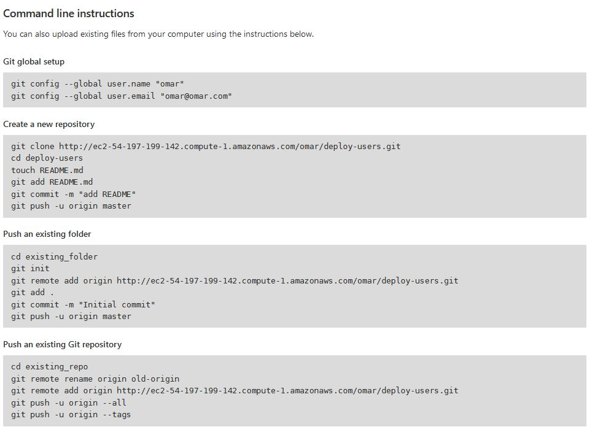
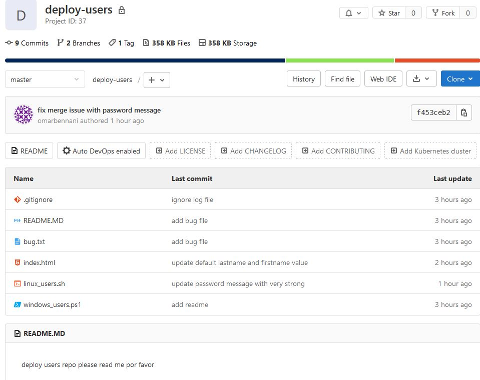
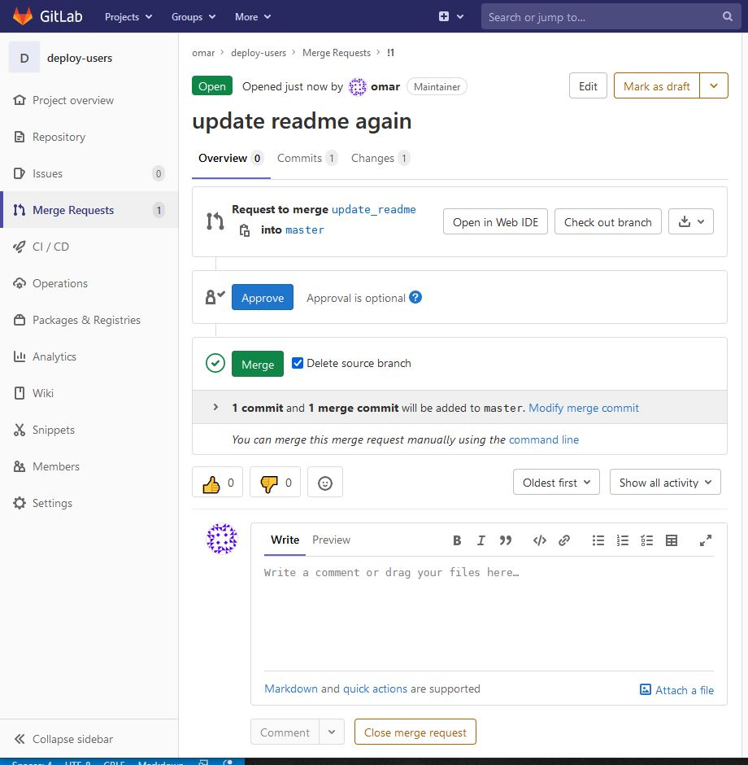
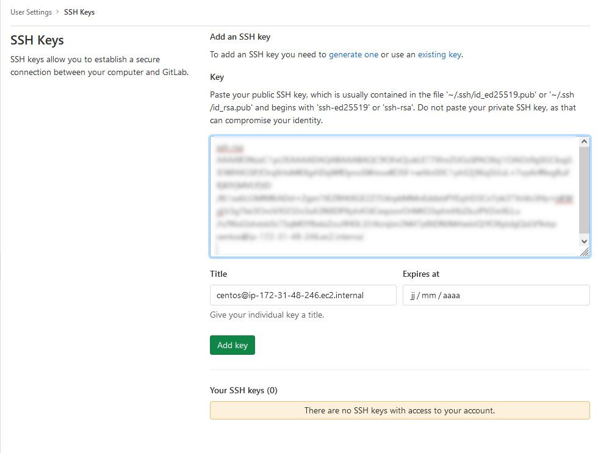
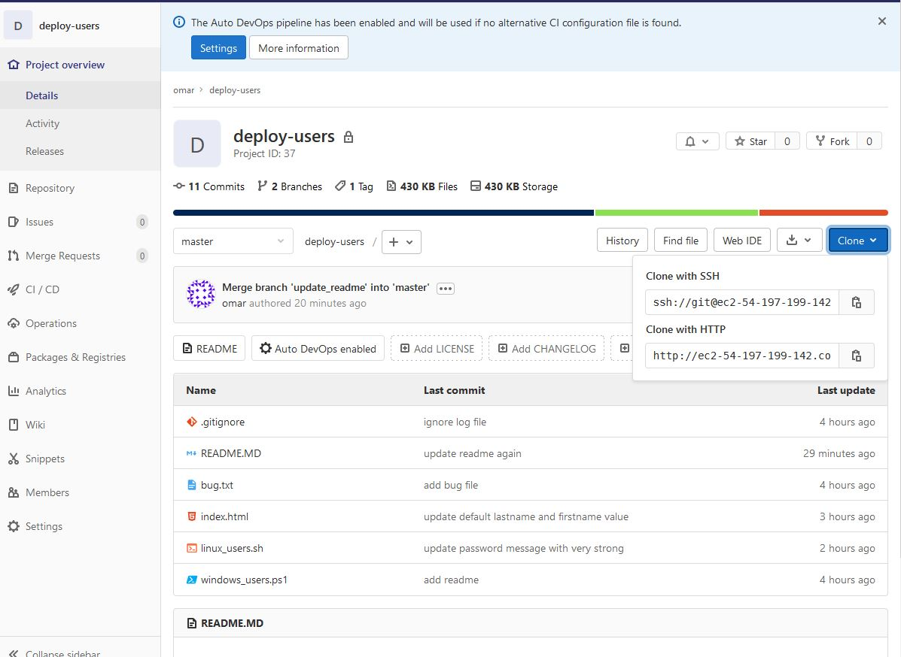

# TP 1 : Initialisation
* Configuration de git 3 fichiers
    * local au projet repertoire courant .git
    * a l'utilisateur : ~/.git
    * a tous le monde : /etc/git/.git

```bash
# completion de ligne de commande 
sudo yum install -y bash-completion bash-completion-extras
git version

git config --global user.name "user"
git config --global user.email "user@mail.com"

cat ~/.gitconfig
git config --list

# definir l'éditeur
git config --global core.editor "vi"
```
https://git-scm.com/docs/git-config


# TP 2 : Commandes de bases
```bash
# Télécharger ce dont on aura besoin pour le projet
sudo yum install -y unzip
curl https://raw.githubusercontent.com/diranetafen/deploy-users-hug/master/deploy-users.zip -o deploy-users.zip
unzip deploy-users.zip
cd deploy-users

# init le repos deploy-users
git init

# créer un fichier readme avec du contenu
echo "deploy users repo" > README.MD

# status des fichiers (ils sont untracked)
git status

# demander a git de les suivres tous les fichier : . → staging
git add .
git status

# faire un commit pour enteriner 
git commit -m "add readme"

# voir l'historique de commit
git log

# création de fichier bug.txt + modification du readme
echo "this is a bug" > bug.txt
echo "please read me por favor" >> README.MD
git status
# bug untracked / README.MD / README.MD en modified

# envoyer en staging 
git add .

# faire un commit
git commit -m "add bug file"

# ignorer les fichier *.log
echo "*.log" > .gitignore
git add .
git commit -m "ignore log file"

echo "server is up and running" > website.log
git status
# git ne le suis pas il n'apparait pas 

# lister les deux derniers commit
git log -2
git log --graph

# créer une release 1.0.0
git tag 1.0.0
git tag

# crer des alias
git config --global alias.st status
git config --global alias.br branch
```


# TP3 : Les branches
```bash
# lister les branches
git branch

# aller sur une autre branche / -b si n'existe pas la créer
git checkout -b update_default_value

# modifier le fichier index
vi index.html

git add index.html
git commit -m "update default lastname and firstname value"

# merger avec la branch master
git checkout master
git merge update_default_value
# ici il a fait un rebase  car Fast-forward

# supprimer la branche car elle ne sert a rien
git branch -d update_default_value

# création/simulation d'un conflit
git checkout -b password_linux
vi linux_users.sh
git add linux_users.sh
git commit -m "update password message with hard"

git checkout master
vi linux_users.sh
git add linux_users.sh
git commit -m "update password message with very strong"
git merge password_linux
# générer une erreur ! ! !
cat linux_users.sh

# modifier le fichier et faire un choix
vi linux_users.sh
git status
git add linux_users.sh
git commit -m "fix merge issue with password message"
```

# TP4 : GitLab introduction
* créer un projet
    * gitlab-training
    * private
* setting → general → Advenced → Expand → delete project

* créer un nouveau projet
    * deploy-users


```bash
git config --global user.name "omar"
git config --global user.email "omar@omar.com"
git remote -v
git remote add origin http://ec2-54-197-199-142.compute-1.amazonaws.com/omar/deploy-users.git
git remote -v
# pour info on pourra avoir plusieur remote et origines

# push de toutes mes branches et de tous mes tags
git push -u origin --all
git push -u origin --tags
```



```bash
# s'assurer qu'on est dans la branche master
git checkout -b update_readme
git checkout -b update_readme master
git status
echo "this code is on gitlab" >> README.MD
git status
git add .
git commit -m "update readme again"
git push origin update_readme
# resultat proposition de merge sur la branche principale:
> remote:   http://ec2-54-197-199-142.compute-1.amazonaws.com/omar/deploy-users/-/merge_requests/new?merge_request%5Bsource_branch%5D=update_readme
```
* Gérer la merge request sur l'interface:
    * approuvé 
    * mergé 


```bash
# il faut maintenant mettre a jour en local notre branch Master
git checkout master
git pull
```

----------------------

## TP5 : Utilisation de clé SSH
```bash
# génération de pair de clé :
ssh-keygen -t rsa
cat /home/centos/.ssh/id_rsa.pub
# Copier cette clé

```
* gitlab → account → settings → ssh key → add key



* il faut mettre origin avec une autre adresse celle SSH



```bash
git remote -v
# mettre à jour l'url d'origine
git remote set-url origin ssh://git@ec2-54-197-199-142.compute-1.amazonaws.com:2222/omar/deploy-users.git
git remote -v
git pull
# confirmer d'enregistrer l'emprunte de cette machine / de lui faire confiance
cat ~/.ssh/known_hosts
```

----------------------

## TP 6 : Travail collaboratif
```bash
# fait par dirane : initialiser le projet
mkdir webapp && cd webapp/
echo "dirahe" > README.MD
git init 
git add .
git commit -m "add dirane"
git remote add origin ssh ssh://git@ec2-54-197-199-142.compute-1.amazonaws.com:2222/ajc/webapp.git
git push origin master
> Rejected
# Echec du push car pas le droit de pousser la modification sur la master ! ! !
# TODO : on change le role utilisateur de dirane → mainteneur
git push origin master
```


```bash
# Mise en place de notre environnement :
cd ..
git clone ssh://git@ec2-54-197-199-142.compute-1.amazonaws.com:2222/ajc/webapp.git
cd webapp

# 2 créer une branche
git checkout -b update_omar

# 3 modifier le fichier Readme
echo "Omar Piotr BENNANI" >> READEME.MD
# 4 effectuer le commit
git add .
git commit -m "je rajoute mon prénom omar"
# ou
git commit -am "je fais un add et un commit en mm temps"

# 5 pusher sur l'origin
git push origin update_omar

# 6 demande de request depuis l'interface
> http://ec2-54-197-199-142.compute-1.amazonaws.com/ajc/webapp/-/merge_requests/new?merge_request%5Bsource_branch%5D=update_omar
```


```bash
# Fixe merge request
git checkout master
git pull
git checkout update_omar
git rebase master
vi README.MD
git add .
git rebase --continue
git status
git log
git push -f origin update_omar
````