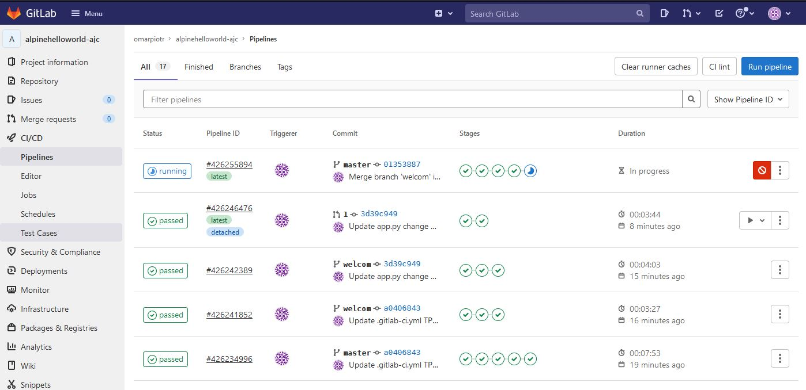

https://gitlab.com/omarpiotr/alpinehelloworld-ajc

--------

# TP1 : Build
* Créer un nouveau Projet Vide sous GitLab
    * alpinehelloworld-ajc
    * public
    * Tout décocher
* Ajouter la clé SSH

* Supprimer un projet :
    * supprimer Settings → General → Advanced settings → Remove Project

* Depuis le terminal de notre VM : pusher le code vers git

```bash
# récupère la clé ssh pour l'ajouter a GitLab
cat ~/.ssh/id_rsa.pub

# Copie du code alpine et clone dans le nouveau repos gitlab
git clone https://github.com/eazytrainingfr/alpinehelloworld.git
cd alpinehelloworld/
git remote -v 
# help
git remote -h
# on supprimer l'origine
git remote remove origin 
git remote -v 
# on modifier l'origine
git remote add origin git@gitlab.com:omarpiotr/alpinehelloworld-ajc.git
# on pousse le code
git push origin master
  
# On créé le fichier et on dépose le contenue donné avec l'enonce
```

* gitlab-ci.yml
```yml
docker-build:
  # Use the official docker image.
  image: docker:latest
  stage: build
  services:
    - docker:dind
  script:
    - docker build -t  alpinehelloworld .
```
* Sur GitLab on lance le pipeline puis on va créer le TAG 

# TP2 : Test d'acceptance
* Modification du pipeline avec un job qui 
    * lance l’image buildée 
    * teste à l’aide de curl

```yml
image: docker:latest

# Use services to specify an additional Docker image to run scripts in. 
# The services image is linked to the image specified in the image keyword. 
services:
  - name: docker:dind
    alias: docker

stages:
  - build
  - Test acceptation

docker-build:
  # Use the official docker image.
  stage: build
  script:
    - docker build -t  alpinehelloworld .
    - docker save alpinehelloworld > alpinehelloworld.tar
  artifacts:
    paths:
      - alpinehelloworld.tar    

test acceptation:
  # Official docker image.
  stage: Test acceptation
  script:
    - docker load < alpinehelloworld.tar
    - docker run -d -p 80:5000 -e PORT=5000 --name webapp alpinehelloworld
    - sleep 5
    - apk --no-cache add curl
    - curl "http://docker" | grep  "Hello world!"

# The Job lauches a docker:latest container.
# → Form that container, the job lauches another container docker:dind with docker alias
# → The Job runs scripts in that container (docker:dind)  
```

# TP3 : Release

* Emplacement des images dockers dans la registry de GitLab :
    * Package & Registry → Contenair Registry
        * registry.gitlab.com/omarpiotr/alpinehelloworld-ajc
        * on peut télécharger l'artefactf (dans notre cas ce sont des images docker)

* Ajout d'unve variable d'environnement pour le projet
    * Setting → CI/CD → Variables → Extend → add variable
        * nom : IMAGE_NAME
        * valeur : registry.gitlab.com/omarpiotr/alpinehelloworld-ajc

```yml
image: docker:latest
services:
  - name: docker:dind
    alias: docker

stages:
  - build
  - Test acceptation
  - Release image

docker-build:
  # Use the official docker image.
  stage: build
  script:
    - docker build -t  alpinehelloworld .
    - docker save alpinehelloworld > alpinehelloworld.tar
  artifacts:
    paths:
      - alpinehelloworld.tar    

test acceptation:
  # Official docker image.
  stage: Test acceptation
  script:
    - docker load < alpinehelloworld.tar
    - docker run -d -p 80:5000 -e PORT=5000 --name webapp alpinehelloworld
    - sleep 5
    - apk --no-cache add curl
    - curl "http://docker" | grep  "Hello world!"

release image:
  stage: Release image
  script:
    - docker load < alpinehelloworld.tar
    - docker tag alpinehelloworld "${IMAGE_NAME}:${CI_COMMIT_REF_NAME}"
    - docker tag alpinehelloworld "${IMAGE_NAME}:${CI_COMMIT_SHORT_SHA}"
    - docker login -u "$CI_REGISTRY_USER" -p "$CI_REGISTRY_PASSWORD" $CI_REGISTRY
    - docker push "${IMAGE_NAME}:${CI_COMMIT_REF_NAME}"
    - docker push "${IMAGE_NAME}:${CI_COMMIT_SHORT_SHA}"

```

# TP4 : Dépoilement prod et staging

* Créer un compte chez HEROKU puis générer/ Récupérez la clé :
    * Account setting → API key → CLE_HEROKU...

* Dans Git Lab créer une nouvelle varibale 
    * HEROKU_API_KEY
    * CLE_HEROKU...

heroku refait un rebuild de l'image avant de la publier

```yml
image: docker:latest
services:
  - name: docker:dind
    alias: docker

stages:
  - build
  - Test acceptation
  - Release image
  - Deploy staging
  - Deploy prod

docker-build:
  # Use the official docker image.
  stage: build
  script:
    - docker build -t  alpinehelloworld .
    - docker save alpinehelloworld > alpinehelloworld.tar
  artifacts:
    paths:
      - alpinehelloworld.tar    

test acceptation:
  # Official docker image.
  stage: Test acceptation
  script:
    - docker load < alpinehelloworld.tar
    - docker run -d -p 80:5000 -e PORT=5000 --name webapp alpinehelloworld
    - sleep 5
    - apk --no-cache add curl
    - curl "http://docker" | grep  "Hello world!"

release image:
  stage: Release image
  script:
    - docker load < alpinehelloworld.tar
    - docker tag alpinehelloworld "${IMAGE_NAME}:${CI_COMMIT_REF_NAME}"
    - docker tag alpinehelloworld "${IMAGE_NAME}:${CI_COMMIT_SHORT_SHA}"
    - docker login -u "$CI_REGISTRY_USER" -p "$CI_REGISTRY_PASSWORD" $CI_REGISTRY
    - docker push "${IMAGE_NAME}:${CI_COMMIT_REF_NAME}"
    - docker push "${IMAGE_NAME}:${CI_COMMIT_SHORT_SHA}"

deploy staging:
  stage: Deploy staging
  environment:
    name: staging
    url: https://omarpiotrajc-staging.herokuapp.com
  only:
    - master
  script:
    - apk --no-cache add npm
    - npm install -g heroku
    - heroku container:login
    - heroku create omarpiotrajc-staging || echo "project already exist"
    - heroku container:push -a omarpiotrajc-staging web
    - heroku container:release -a omarpiotrajc-staging web

deploy prod:
  stage: Deploy prod
  environment:
    name: prod
    url: https://omarpiotrajc-prod.herokuapp.com
  only:
    - master
  script:
    - apk --no-cache add npm
    - npm install -g heroku
    - heroku container:login
    - heroku create omarpiotrajc-prod  || echo "project already exist"
    - heroku container:push -a omarpiotrajc-prod web
    - heroku container:release -a omarpiotrajc-prod web    
```

# TP5 : Déploiement de review 

* Deploiement d'une review si Merge Request
* Si validation de la Merge Request :
    * suppression de la review
    * déploiment des nouveaux prod et staging

* Etapes :
    * créer une nouvelle branche : welcom
        * 3 job lancé dans ce pipline (les autres ne sont pas lancé car ne concerne pas la branche Master)
    * sur la branche welcome 
        * modifier app.py pour notre test
        * faire un commit (dans la CI toujours 3 jobs)
    * déclanche une webRequest
        * Merge Request (assign) → Delete branche source → create Merge Request
        cela doit créer les environnement de revue (Depoyement)
    * Deployement → Environnement (l'environnement review pour la branche welcom apparait)
    * On valide la Merge Request 
        * le pipline se lance :
            * supprimer l'environnement review
            * met à jour les environnement prod et staging



```yml
image: docker:latest
services:
  - name: docker:dind
    alias: docker

stages:
  - build
  - Test acceptation
  - Release image
  - Deploy review
  - Stop review
  - Deploy staging
  - Deploy prod

docker-build:
  # Use the official docker image.
  stage: build
  script:
    - docker build -t  alpinehelloworld .
    - docker save alpinehelloworld > alpinehelloworld.tar
  artifacts:
    paths:
      - alpinehelloworld.tar    

test acceptation:
  # Official docker image.
  stage: Test acceptation
  script:
    - docker load < alpinehelloworld.tar
    - docker run -d -p 80:5000 -e PORT=5000 --name webapp alpinehelloworld
    - sleep 5
    - apk --no-cache add curl
    - curl "http://docker" | grep  "Hello world!"

release image:
  stage: Release image
  script:
    - docker load < alpinehelloworld.tar
    - docker tag alpinehelloworld "${IMAGE_NAME}:${CI_COMMIT_REF_NAME}"
    - docker tag alpinehelloworld "${IMAGE_NAME}:${CI_COMMIT_SHORT_SHA}"
    - docker login -u "$CI_REGISTRY_USER" -p "$CI_REGISTRY_PASSWORD" $CI_REGISTRY
    - docker push "${IMAGE_NAME}:${CI_COMMIT_REF_NAME}"
    - docker push "${IMAGE_NAME}:${CI_COMMIT_SHORT_SHA}"

deploy staging:
  stage: Deploy staging
  environment:
    name: staging
    url: https://omarpiotrajc-staging.herokuapp.com
  only:
    - master
  script:
    - apk --no-cache add npm
    - npm install -g heroku
    - heroku container:login
    - heroku create omarpiotrajc-staging || echo "project already exist"
    - heroku container:push -a omarpiotrajc-staging web
    - heroku container:release -a omarpiotrajc-staging web

deploy prod:
  stage: Deploy prod
  environment:
    name: prod
    url: https://omarpiotrajc-prod.herokuapp.com
  only:
    - master
  script:
    - apk --no-cache add npm
    - npm install -g heroku
    - heroku container:login
    - heroku create omarpiotrajc-prod  || echo "project already exist"
    - heroku container:push -a omarpiotrajc-prod web
    - heroku container:release -a omarpiotrajc-prod web    

deploy review:
  stage: Deploy review
  environment:
    name: review/$CI_COMMIT_REF_NAME
    url: https://omarpiotrajc-$CI_COMMIT_REF_NAME.herokuapp.com
    on_stop: stop review
  only:
    - merge_requests
  script:
    - apk --no-cache add npm
    - npm install -g heroku
    - heroku container:login
    - heroku create omarpiotrajc-$CI_COMMIT_REF_NAME  || echo "project already exist"
    - heroku container:push -a omarpiotrajc-$CI_COMMIT_REF_NAME web
    - heroku container:release -a omarpiotrajc-$CI_COMMIT_REF_NAME web

stop review:
  stage: Stop review
  variables:
    GIT_STRATEGY: none
  environment:
    name: review/$CI_COMMIT_REF_NAME
    action: stop
  only:
    - merge_requests
  when: manual
  script:
    - apk --no-cache add npm
    - npm install -g heroku
    - heroku container:login
    - heroku apps:destroy -a omarpiotrajc-$CI_COMMIT_REF_NAME -c omarpiotrajc-$CI_COMMIT_REF_NAME

```

# TP6 : Template pour factoriser le code

```yml
image: docker:latest
services:
  - name: docker:dind
    alias: docker

stages:
  - build
  - Test acceptation
  - Release image
  - Deploy review
  - Stop review
  - Deploy staging
  - Test staging  
  - Deploy prod
  - Test prod

.test_template: &test
  image: alpine
  only:
    - master
  script:
    - apk --no-cache add curl
    - curl "https://$DOMAIN" | grep "Hello world!"  

docker-build:
  # Use the official docker image.
  stage: build
  script:
    - docker build -t  alpinehelloworld .
    - docker save alpinehelloworld > alpinehelloworld.tar
  artifacts:
    paths:
      - alpinehelloworld.tar    

test acceptation:
  # Official docker image.
  stage: Test acceptation
  script:
    - docker load < alpinehelloworld.tar
    - docker run -d -p 80:5000 -e PORT=5000 --name webapp alpinehelloworld
    - sleep 5
    - apk --no-cache add curl
    - curl "http://docker" | grep  "Hello world!"

release image:
  stage: Release image
  script:
    - docker load < alpinehelloworld.tar
    - docker tag alpinehelloworld "${IMAGE_NAME}:${CI_COMMIT_REF_NAME}"
    - docker tag alpinehelloworld "${IMAGE_NAME}:${CI_COMMIT_SHORT_SHA}"
    - docker login -u "$CI_REGISTRY_USER" -p "$CI_REGISTRY_PASSWORD" $CI_REGISTRY
    - docker push "${IMAGE_NAME}:${CI_COMMIT_REF_NAME}"
    - docker push "${IMAGE_NAME}:${CI_COMMIT_SHORT_SHA}"

deploy staging:
  stage: Deploy staging
  environment:
    name: staging
    url: https://omarpiotrajc-staging.herokuapp.com
  only:
    - master
  script:
    - apk --no-cache add npm
    - npm install -g heroku
    - heroku container:login
    - heroku create omarpiotrajc-staging || echo "project already exist"
    - heroku container:push -a omarpiotrajc-staging web
    - heroku container:release -a omarpiotrajc-staging web

deploy prod:
  stage: Deploy prod
  environment:
    name: prod
    url: https://omarpiotrajc-prod.herokuapp.com
  only:
    - master
  script:
    - apk --no-cache add npm
    - npm install -g heroku
    - heroku container:login
    - heroku create omarpiotrajc-prod  || echo "project already exist"
    - heroku container:push -a omarpiotrajc-prod web
    - heroku container:release -a omarpiotrajc-prod web    

deploy review:
  stage: Deploy review
  environment:
    name: review/$CI_COMMIT_REF_NAME
    url: https://omarpiotrajc-$CI_COMMIT_REF_NAME.herokuapp.com
    on_stop: stop review
  only:
    - merge_requests
  script:
    - apk --no-cache add npm
    - npm install -g heroku
    - heroku container:login
    - heroku create omarpiotrajc-$CI_COMMIT_REF_NAME  || echo "project already exist"
    - heroku container:push -a omarpiotrajc-$CI_COMMIT_REF_NAME web
    - heroku container:release -a omarpiotrajc-$CI_COMMIT_REF_NAME web

stop review:
  stage: Stop review
  variables:
    GIT_STRATEGY: none
  environment:
    name: review/$CI_COMMIT_REF_NAME
    action: stop
  only:
    - merge_requests
  when: manual
  script:
    - apk --no-cache add npm
    - npm install -g heroku
    - heroku container:login
    - heroku apps:destroy -a omarpiotrajc-$CI_COMMIT_REF_NAME -c omarpiotrajc-$CI_COMMIT_REF_NAME

test staging:
  <<: *test
  stage: Test staging
  variables:
    DOMAIN: omarpiotrajc-staging.herokuapp.com

test prod:
  <<: *test
  stage: Test prod
  variables:
    DOMAIN: omarpiotrajc-prod.herokuapp.com
```