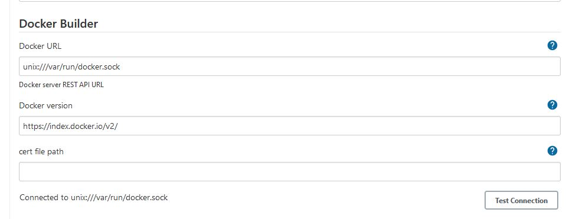
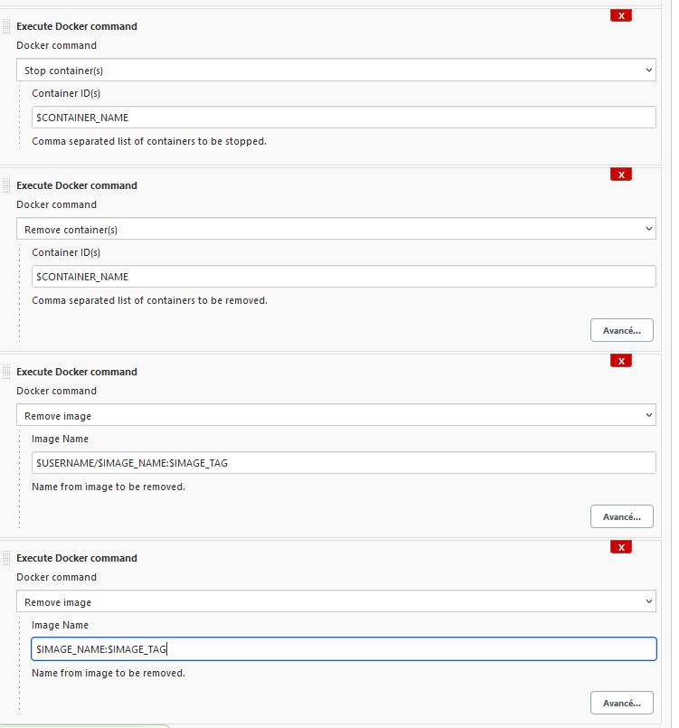
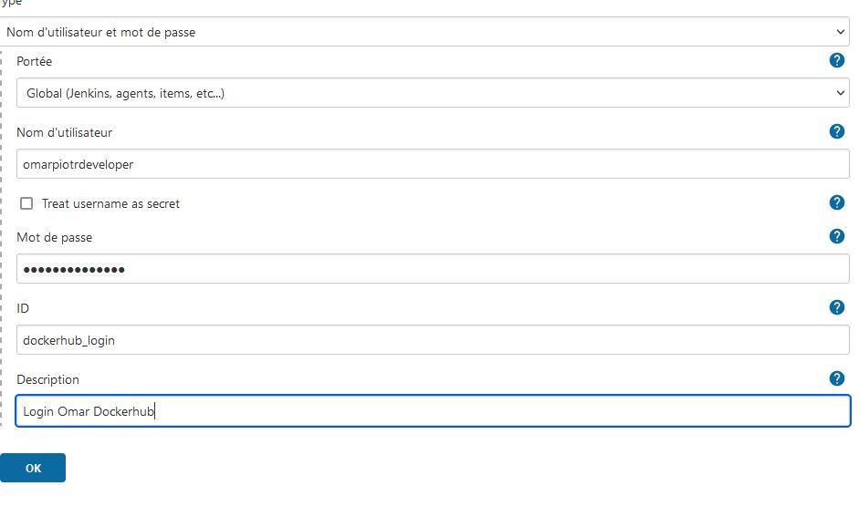
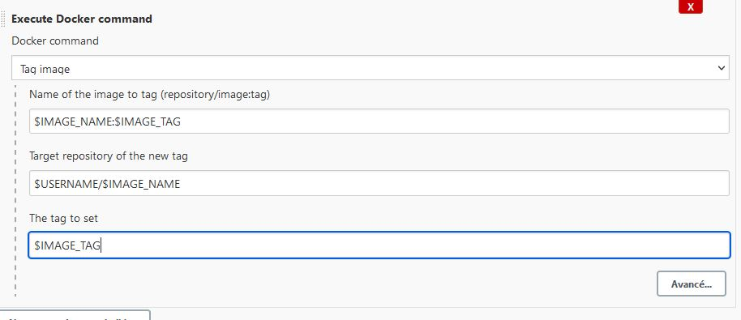
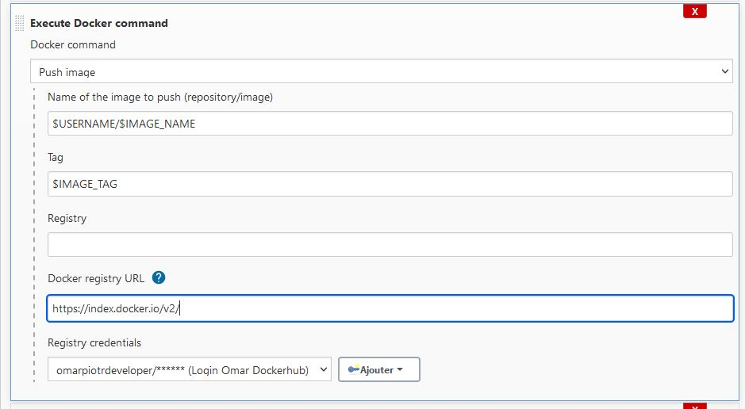
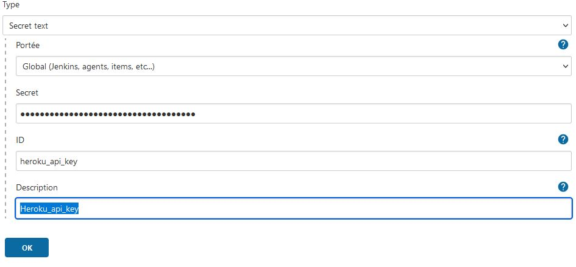
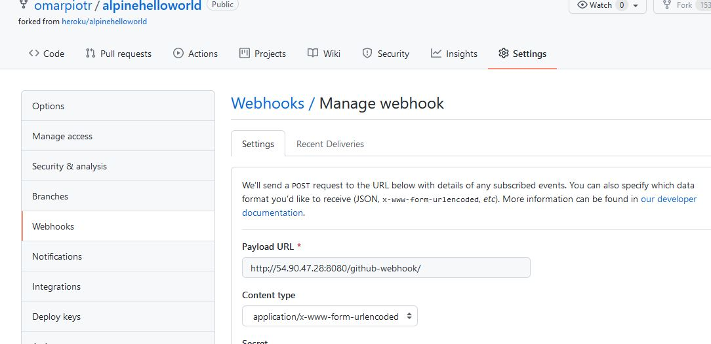

# TP1 : Installation de Jenkins

https://github.com/sadofrazer/jenkins-frazer.git

[ AWS : EC2] → Instances → Créer une instance
* t2.large
* lancer docker compose
* SSD 20 Go
* Sécurity Group : 22 / 8080
```bash
#!/bin/bash
#Install Git
apt-get install -y git 
#Clone du Repo
git clone https://github.com/sadofrazer/jenkins-frazer.git
cd jenkins-frazer
#Install docker
curl -fsSL https://get.docker.com -o get-docker.sh
sh get-docker.sh
sudo usermod -aG docker ubuntu
#Install Docker compose
sudo curl -L "https://github.com/docker/compose/releases/download/1.29.2/docker-compose-$(uname -s)-$(uname -m)" -o /usr/local/bin/docker-compose
sudo chmod +x /usr/local/bin/docker-compose
#lancement Jenkins
docker-compose up -d
```

Depuis notre VM
```bash
# Récupérer le code qui se trouve dans notre conteneur:
docker ps
docker exec jenkins-frazer_jenkins_1 cat /var/lib/jenkins/secrets/initialAdminPassword
docker exec -it jenkins-frazer_jenkins_1 /bin/bash
```
* Se connecter sur http://54.90.47.28:8080/
* Installer les plugins suggréré
* créer utilisateur

# TP 2 : Interface de Jenkins

## Forker et cloner le projet

* forker le projet sur notre repos Git : https://github.com/heroku/alpinehelloworld
* Cloner le repos sur notre machine locale : git clone git@github.com:omarpiotr/alpinehelloworld.git

## Premier Projet Freestyle sur Jenkins

[ Jenkins ] : http://54.90.47.28:8080/
* Nouveau projet de type freestyle : ajc-alpinehelloword
* Description Webbapp
* cocher : ce build a des paramètres
    * string :
        * IMAGE_NAME
        * alpinehelloworld
    * string :
        * IMAGE_TAG
        * ajc-1.0
    * string :
        * CONTAINER_NAME
        * alpinehelloworld
    * string :
        * USERNAME
        * omarpiotrdeveloper
    * Mot de pass :
        * PASSWORD
        * mdp de dockerhub / clé token de dockerhub
* Gestionnaire de code : Aucune
* Build : Ajouter une étape au build
    * script shell : (créer l'image)
    ```sh
    #!/bin/bash
    git clone https://github.com/omarpiotr/alpinehelloworld.git
    cd alpinehelloworld
    docker build -t $IMAGE_NAME:$IMAGE_TAG .
    ```
    * script shell : (lancer et tester un conteneur)
    ```sh
    #!/bin/bash
    # j'arrête et je supprimer si un conteneur existe déjà
    docker stop $CONTAINER_NAME || true
    docker rm $CONTAINER_NAME || true
    docker run -d --name $CONTAINER_NAME -e PORT=5000 -p 5000:5000 $IMAGE_NAME:$IMAGE_TAG
    sleep 5
    curl http://localhost:5000 | grep -iq "Hello world!"
    ```
    * script shell : (copier d'image dans docker Hub puis supprimer)
    ```sh
    #!/bin/bash
    docker login -u $USERNAME -p $PASSWORD
    docker tag $IMAGE_NAME:$IMAGE_TAG $USERNAME/$IMAGE_NAME:$IMAGE_TAG
    docker push $USERNAME/$IMAGE_NAME:$IMAGE_TAG
    docker stop $CONTAINER_NAME
    docker rm $CONTAINER_NAME
    docker rmi $USERNAME/$IMAGE_NAME:$IMAGE_TAG
    docker rmi $IMAGE_NAME:$IMAGE_TAG
    ```
# TP 3 : Tests d'acceptances
## Installer le plugin http_request

* Administrer jenkins → Plugins → plugin disponible
    * http_request → selectionner → install withhout restart

## Configurer/Utiliser le plugin dans notre projet

* Tableau de bord → projet → configurer
* ajouter  HTTP Request
    * url : http://localhost:5000
    * Avancé → Response → Response codes expected : 200

## Installer et configurer docker-build-step 

* Administrer Jenkins → Plugin → Installer docker-build-step
* Administrer Jenkins → Configurer le system
    * administrer → configurer → Docker Builder :
        * unix:///var/run/docker.sock
        * https://index.docker.io/v2/
        * Test Connection



## Utiliser le plugin docker-build-step dans notre projet

* On va remplacer les commandes précédentes dans le script par le plugin par des commandes Docker :
```sh
# a supprimer
docker stop $CONTAINER_NAME
docker rm $CONTAINER_NAME
docker rmi $USERNAME/$IMAGE_NAME:$IMAGE_TAG
docker rmi $IMAGE_NAME:$IMAGE_TAG
```
* Ajouter des étapes au build : "Exectuer une commande docker"




# TP4 : Artefacts et Credentials

## Crédentials

Administrer Jenkins → Manage credential → portée global → ajouter des indentifiant
* Nom utilisateur et MDP
* Global
* userDockerHub
* Password Docker Hub
* ID : dockerhub_login



## Utiliser le plugin docker pour tagger et pusher

* Supprimer  cette étape
    ```sh
    #!/bin/bash
    docker login -u $USERNAME -p $PASSWORD
    docker tag $IMAGE_NAME:$IMAGE_TAG $USERNAME/$IMAGE_NAME:$IMAGE_TAG
    docker push $USERNAME/$IMAGE_NAME:$IMAGE_TAG
    ```
* Créer 2 étapes : Une pour le Tag et une pour le PUSH

<br>



# TP5 : PROJET DE TYPE : PIPLINE (as code)

## Rajouter 2 crédentials:

* Administrer Jenkins → Manage Credentials → Global → Add Credential
    * Portée : Global
    * Type : Secret text
        * Secret : Token de Heroku
        * ID: heroku_api_key

    * Portée : Global
    * Type : Secret text
        * Secret : Token de docker Hub
        * ID: dockerhub_password



## Installer le pugin : GitHub Integration

Administrer Jenkins → Plugin → Installer GitHub Integration 

## Créer un Pipline de déploiement sur Heroku

* Ajouter le fichier Jenkinsfile dans le projet
```Groovy
pipeline {

    environment {
        IMAGE_NAME = "alpinehelloworld"
        IMAGE_TAG = "ajc-2.1"
        STAGING = "omar-ajc-staging-env"
        PRODUCTION = "omar-ajc-prod-env"
        USERNAME = "omarpiotrdeveloper"
        CONTAINER_NAME = "alpinehelloworld"
    }

    agent none

    stages{

       stage ('Build Image'){
           agent any
           steps {
               script{
                   sh 'docker build -t $USERNAME/$IMAGE_NAME:$IMAGE_TAG .'
               }
           }
       }

       stage ('Run test container') {
           agent any
           steps {
               script{
                   sh '''
                       docker stop $CONTAINER_NAME || true
                       docker rm $CONTAINER_NAME || true
                       docker run --name $CONTAINER_NAME -d -e PORT=5000 -p 5000:5000 $USERNAME/$IMAGE_NAME:$IMAGE_TAG
                       sleep 5
                   '''
               }
           }
       }

       stage ('Test container') {
           agent any
           steps {
               script{
                   sh '''
                       curl http://localhost:5000 | grep -iq "Hello world!"
                   '''
               }
           }
       }

       stage ('clean env and save artifact') {
           agent any
           environment{
               PASSWORD = credentials('dockerhub_password')
           }
           steps {
               script{
                   sh '''
                       docker login -u $USERNAME -p $PASSWORD
                       docker push $USERNAME/$IMAGE_NAME:$IMAGE_TAG
                       docker stop $CONTAINER_NAME || true
                       docker rm $CONTAINER_NAME || true
                       docker rmi $USERNAME/$IMAGE_NAME:$IMAGE_TAG
                   '''
               }
           }
       }

       stage('Push image in staging and deploy it') {
            when {
                expression { GIT_BRANCH == 'origin/master' }
            }
            agent any
            environment {
                HEROKU_API_KEY = credentials('heroku_api_key')
            }  
            steps {
                script {
                   sh '''
                       heroku container:login
                       heroku create $STAGING || echo "project already exist"
                       heroku container:push -a $STAGING web
                       heroku container:release -a $STAGING web
                    '''
                }
            }
        }

        stage('Push image in Prod and deploy it') {
            when {
                expression { GIT_BRANCH == 'origin/master' }
            }
            agent any
            environment {
                HEROKU_API_KEY = credentials('heroku_api_key')
            }  
            steps {
                script {
                   sh '''
                       heroku container:login
                       heroku create $PRODUCTION || echo "project already exist"
                       heroku container:push -a $PRODUCTION web
                       heroku container:release -a $PRODUCTION web
                    '''
                }
            }
        }         
    }

}
```
[ Jenkins ] → Nouveau Item
* deploy-helloworld
* Pipline
    * (Cocher) GitHub project : GitHub_URL
    * (Cocher) GitHub hook trigger
    * Avancé
        * Pipline script from SCM
            * SCM : GIT
            * Repoistory URL : GitHub_URL
            * Crédential (aucun) car repo public

* Lancer notre build

## Webhook Trigger : Relier GitHub a notre Jenkis

[ GitHub ] : Projet → Settings → add webhook
* Set URL de Jenkins: http://54.90.47.28:8080/github-webhook/

