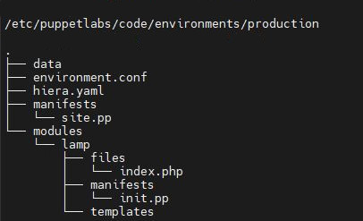

# 1) INSTALLATION / CONFIGURATIONS PUPPET

## 1.1) PRE-REQUIS (AWS)
* EC2
    * serveur : t2.medium (4Go RAM / 2 CPU / 20 Go)
    * agents : t2.micro
* SG
    * Ports SSH (22) / ICMP (ping) / 8140 (puppet)
* Les machines doivent être sur le même VLAN

## 1.2) Initialisation des 2 machines
```bash
# initialisation
sudo su -
yum update -y
yum install vim -y

# renomer nos hostname : puppetmaster / agents
vim /etc/hostname

# ajouter des hosts
vim /etc/hosts 
# ou
echo '172.31.95.61 puppetmaster.omar.edu puppetmaster' >> /etc/hosts
echo '172.31.83.83 agentcentos.omar.edu agentcentos' >> /etc/hosts
echo "172.31.94.237 agentubuntu.omar.edu agentubuntu" >> /etc/hosts
# ou 
echo -e '172.31.95.61 puppetmaster.omar.edu puppetmaster\n172.31.83.83 agentcentos.omar.edu agentcentos\n172.31.94.237 agentubuntu.omar.edu agentubuntu' >> /etc/hosts

# vérifier nameserver 172.31.0.2
cat /etc/resolv.conf

# SELENUX=disabled
vi /etc/sysconfig/selinux
# ou
vi /etc/selinux/config
# redémarrer le system

# Test de ping depuis chacunes des machines
ping puppetmaster.omar.edu
ping agentcentos.omar.edu
ping agentubutnu.omar.edu
```
## 1.3) Configuration de la machine SERVEUR
```bash
# ajouter le dépot
rpm -Uvh https://yum.puppet.com/puppet7-release-el-7.noarch.rpm
yum update

# installer le serveur (+agent)
yum install puppetserver -y
systemctl start puppetserver
systemctl enable puppetserver

# déconnecter et se reconnecter avec sudo
exit
sudo su -

# vérifications
where is puppet
yum info puppetserver
yum info puppet-agent
puppetserver -v

# configuration
vi /etc/puppetlabs/puppet/puppet.conf
```

```
[master]
dns_alt_names = puppetmaster.omar.edu,puppetmaster

[main]
certname = puppetmaster.omar.edu
server = puppetmaster.omar.edu
environment = production
runinterval = 1h 
```

```bash
# redémmarrer le serveur
systemctl restart puppetserver

# afficher les certificat signés par le serveur
puppetserver ca list --all
# ca_crt.pem = certificat qui va signer
```

* puppet : commande pour l'agent
* puppetserver : pour le serveur


## 1.4) Configuration de la machine CLIENT / SLAVE (centos)
```bash
# installation de l'agent
rpm -Uvh https://yum.puppet.com/puppet7-release-el-7.noarch.rpm
yum update
yum install puppet-agent -y

# déconnecter et se reconnecter avec sudo
exit
sudo su -

# vérifications
where is puppet
yum info puppet-agent

# configuration
vi /etc/puppetlabs/puppet/puppet.conf
```
```
[main]
certname = agentcentos.omar.edu
server = puppetmaster.omar.edu
environment = production
runinterval = 1h 
```

## 1.5) Configuration de la machine CLIENT / SLAVE (ubuntu)
```bash
sudo su -
apt-get update
# renomer nos hostname : puppetmaster / agents
vim /etc/hostname
# ajouter des hosts
vim /etc/hosts 

# installer puppet
wget https://apt.puppet.com/puppet7-release-focal.deb
sudo dpkg -i puppet7-release-focal.deb
sudo apt-get update
sudo apt-get install puppet-agent

# configuration
vi /etc/puppetlabs/puppet/puppet.conf

# sortir et rerentrer dans le sudo
exit
sudo su -
```
```
[main]
certname = agentubuntu.omar.edu
server = puppetmaster.omar.edu
environment = production
runinterval = 1h 
```

## 1.6) Démarrage de l'agent et signature du certificat
* coté agent : envoyer la demande de certifcat au serveur/master
    ```bash
    # activer l'agent qui va envoyer la demande de certificats 
    puppet resource service puppet ensure=running enable=true
    # verifier 
    systemctl status puppet
    ```
* coté serveur : singer le certificat venant de l'agent
    ```bash
    # afficher les certificats en attente de validation (celui de l'agent)
    puppetserver ca list
    # générer puis singer le certificat
    puppetserver ca sign --certname agentcentos.omar.edu
    puppetserver ca sign --certname agentubuntu.omar.edu
    ```

# 2) LAB 0 : Premier manifest  (création d'un repertoire)
## serveur puppet
```bash
cd /etc/puppetlabs/code/environments/production/manifests/
# le premier manifest qui est lu est site.pp
vim site.pp
```
```ruby
node 'client.omar.edu' 
{
    file { '/tmp/omar':
        ensure => 'directory',
        owner => 'root',
        group => 'root',
        mode => '0755',
    }

    group {'omar':
        ensure => present,
        name => 'omar',
        gid => '2000',
    }

    user {'omar':
        ensure => present,
        uid => '2000',
        gid => '2000',
        shell => '/bin/bash',
        home => '/home/omar'
    }

    file { '/home/omar':
        ensure => 'directory',
        owner => 'omar',
        group => 'omar',
        mode => '0755',
    }
}
```

## client / agent 
```bash
# On force l'agent à tester le serveur sans attendre l'interval
puppet agent -t
# ou
puppet agent --test
```

# 3) LAB 1 : Installation d'un serveur LAMP
* agent sur machine centos : httpd / mariadb / php
* agent sur machine ubuntu : apache2/ mysql / php
* création d'un module "lamp" sous puppet

    

```Ruby
# /etc/puppetlabs/code/environments/production/manifests/site.pp
node 'agentcentos.omar.edu' 
{
    include lamp
}

node 'agentubuntu.omar.edu' 
{
    include lamp
}
```

```Ruby
#  /etc/puppetlabs/code/environments/production/modules/lamp/manifests/init.pp
class lamp::update {
    if $facts['os']['name'] == 'Ubuntu'
    {
        exec { 'update':     
            command => "/usr/bin/apt-get update -y"   
        }
    }
    elsif $facts['os']['name'] == 'CentOS'
    {
        exec { 'update':     
            command => "/usr/bin/yum update -y"  
        }
    }   
}

class lamp::epel_release {
    if $facts['os']['family'] == 'RedHat'
    {
        package { 'epel-release':
            require => Class['lamp::update'],
            ensure => installed,      
        }
    }
}

class lamp::apache {
    $web = $operatingsystem ? 
    {
        /(Red Hat|CentOS|Fedora)/ => "httpd", 
        'Ubuntu' => "apache2",
        default => "httpd",
    }
    package { "apache lamp":
        name => $web,
        require => Class['lamp::update'],
        ensure => installed,        
    }
}

class lamp::apache_service {
    service { 'apache lamp':
        name => $operatingsystem ?
        {
            /(Red Hat|CentOS|Fedora)/ => "httpd", 
            'Ubuntu' => "apache2",
            default => "httpd",
        },
        ensure => running,
    }
}

class lamp::mysql { 
    package { 'mysql lamp':
    name => $operatingsystem ?
        {
            /(Red Hat|CentOS|Fedora)/ => "mariadb", 
            'Ubuntu' => "mysql-server",
        },
        ensure => installed,      
    }
}

class lamp::mysql_service {
    service { 'mysql lamp':
        name => $operatingsystem ?
        {
            /(Red Hat|CentOS|Fedora)/ => "mariadb", 
            'Ubuntu' => "mysql",
        },
        ensure => running,
    }
}

class lamp::php {
    package { 'php':
        require => Class['lamp::update'],
        ensure => installed,                
    }
}

class lamp::php_init {
    file { '/var/www/html/index.php':
        ensure => file,
        source => "puppet:///modules/lamp/index.php",
        require => Class['lamp::apache'],
        notify => Class['lamp::apache_service'],
    }

    if $facts['os']['family'] == 'RedHat'
    {
        file { '/etc/httpd/conf.d/welcome.conf':
            ensure => absent,
            notify => Class['lamp::apache_service'],       
        }
    }

    if $facts['os']['name'] == 'Ubuntu'
    {
        file { '/var/www/html/index.html':
            ensure => absent,
            notify => Class['lamp::apache_service'],       
        }
    } 
}

class lamp {
    include lamp::update, lamp::epel_release, lamp::apache, lamp::apache_service, lamp::mysql, lamp::mysql_service, lamp::php, lamp::php_init
}

```

```html
<!-- /etc/puppetlabs/code/environments/production/modules/lamp/files/index.php -->
<!DOCTYPE html>
<html>
<body>

<h1>Omar Piotr LAMP</h1>
<p><?php
    echo "<div>Bonjour</div>";
    phpinfo(); ?></p>

</body>
</html> 
```

# 4) LAB 2 : Installation de bind9 
Installation et configuration d'un serveur bind9 via puppet<br>
Installation et configuration d'outils bind-test pour utiliser et tester notre serveur 
## 4.1) Prérequis
* Ouvrir le port DNS (53) dans le Sécurity Group de AWS
* Machines :
    * puppetMaster (centos)
    * client (centos)
    * agentcentos (centos)
    * agentubuntu (ubuntu)
## 4.2) But / A faire
* agentcentos
    * installer le serveur bind9
    * configurer ce serveur
        * modifier fichier /etc/named.config
        * créer fichier /etc/named/omar.local.com.db
        * créer fichier /etc/named/172.31.db
* Notre serveur DNS résoudra les noms suivant :
    * ns1.omar.local.com 172.31.83.83 (agentcentos)
    * www.omar.local.com 172.31.90.80 (fictif)
    * mail.omar.local.com 172.31.90.25 (fictif)
    * ftp.omar.local.com <=> www.omar.local.com
* agentubuntu et client  
    * installer le packet bind-test pour faire des requêtes dig ou host
    * configurer /etc/resolv.conf

## 4.3) Informations sur notre réseau
* En tapant `ip a` sur notre machine **agentcentos** on obtient les informations suivantes :
    * Adresse IP : 172.31.83.83 /20
    * Adresse Broadcast : 172.31.95.255
* On peut donc calculer l'adresse IP de notre réseau qui est :
    * Adresse Reseau : 172.31.80.0/20

## 4.4) Création du Module binddns (sur le serveur Puppet)
```bash
cd /etc/puppetlabs/code/environments/production/modules/
mkdir -p binddns/{files,templates,manifests}
```

#### **`modules/binddns/files/named.conf`**
```
options {
    listen-on port 53 { 127.0.0.1; 172.31.83.83; };
    allow-query     { localhost; 172.31.80.0/20; };
};

// Forward Zone
zone "omar.local.com" IN {        
    type master;      
    file "/etc/named/omar.local.com.db";
    allow-update { none; };
};

// Reverse Zone
zone "31.172.in-addr.arpa" IN {         
    type master;        
    file "/etc/named/172.31.db";      
    allow-update { none; };
};
```
#### **`modules/binddns/files/omar.local.com.db`**
```
@   IN  SOA     ns1.omar.local.com. root.omar.local.com. (
                                                1001    ;Serial
                                                3H      ;Refresh
                                                15M     ;Retry
                                                1W      ;Expire
                                                1D      ;Minimum TTL
                                                )

;Name Server Information
@       IN      NS      ns1.omar.local.com.

;IP address of Name Server
ns1     IN      A       172.31.83.83

;Mail exchanger
omar.local.com. IN  MX 10   mail.omar.local.com.

;A - Record HostName To IP Address
www     IN      A       172.31.90.80
mail    IN      A       172.31.90.25

;CNAME record
ftp     IN      CNAME   www.omar.local.com.
```

#### **`modules/binddns/files/172.31.db`**
```
@   IN  SOA     ns1.omar.local.com. root.omar.local.com. (
                                                1001    ;Serial
                                                3H      ;Refresh
                                                15M     ;Retry
                                                1W      ;Expire
                                                1D      ;Minimum TTL
                                                )

;Name Server Information
@       IN      NS      ns1.omar.local.com.

;Reverse lookup for Name Server
83.83   IN      PTR     ns1.omar.local.com.

;PTR Record IP address to HostName
80.90   IN      PTR     www.omar.local.com.
25.90   IN      PTR     mail.omar.local.com.
```

#### **`modules/binddns/manifests/init.pp`**
```ruby
class binddns::update {
    if $facts['os']['name'] == 'Ubuntu'
    {
        exec { 'update2':     
            command => "/usr/bin/apt-get update -y"   
        }
    }
    elsif $facts['os']['name'] == 'CentOS'
    {
        exec { 'update2':     
            command => "/usr/bin/yum update -y"  
        }
    }  
}

# uniquement pour CentOS
class binddns::server_install {
    package { 'bind':
        require => Class['binddns::update'],
        ensure => installed,                
    }
}

# uniquement pour CentOS
class binddns::server_config {
    # copie du fichier named.conf
    file { '/etc/named.conf':
        ensure => file,
        source => "puppet:///modules/binddns/named.conf",
        require => Class['binddns::server_install'],
    }
    # copie du fichier omar.local.com.db
    file { '/etc/named/omar.local.com.db':
        ensure => file,
        source => "puppet:///modules/binddns/omar.local.com.db",
        require => Class['binddns::server_install'],
    }
    # copie du fichier 172.31.db
    file { '/etc/named/172.31.db':
        ensure => file,
        source => "puppet:///modules/binddns/172.31.db",
        require => Class['binddns::server_install'],
        notify => Class['binddns::service'],
    }
}

# uniquement pour CentOS
class binddns::service {
    service { 'named':
        ensure => running,
    }
}

# pour CentOS et Ubuntu
class binddns::client_install {
    package { 'bind utils':
        name => $operatingsystem ?
        {
            /(Red Hat|CentOS|Fedora)/ => "bind-utils", 
            'Ubuntu' => "dnsutils",
        },
        require => Class['binddns::update'],
        ensure => installed,                
    }
}

class binddns::client_config {
    file { '/etc/resolv.conf':
        ensure => file,
        content => 'nameserver 172.31.83.83'
    }
}

class binddns{
    include binddns::update, binddns::server_install, binddns::server_config, binddns::service, binddns::client_install, binddns::client_config
}
```

#### **`/manifests/site.pp`**
```ruby
node 'client.omar.edu' 
{
    include binddns::update, binddns::client_install, binddns::client_config
}

node 'agentcentos.omar.edu' 
{
    include lamp, binddns
}

node 'agentubuntu.omar.edu' 
{
    include lamp, binddns::update, binddns::client_install, binddns::client_config
}
```

## 4.5) Mise en place
* Depuis chacune des machines dans l'ordre suivant on va exectuer l'agent :
    * agentcentos
    * agentubuntu
    * client
```bash
puppet agent -t
```

## 4.6) Vérifications
* Etant donné que toutes ces machines disponsent du bind-util on lancera les commandes suivantes :
```bash
host 172.31.83.83
    83.83.31.172.in-addr.arpa domain name pointer ns1.omar.local.com.
host 172.31.90.25
    25.90.31.172.in-addr.arpa domain name pointer mail.omar.local.com.
host 172.31.90.80
    80.90.31.172.in-addr.arpa domain name pointer www.omar.local.com.

host www.omar.local.com
    www.omar.local.com has address 172.31.90.80
host ftp.omar.local.com
    ftp.omar.local.com is an alias for www.omar.local.com.
    www.omar.local.com has address 172.31.90.80
host mail.omar.local.com
    mail.omar.local.com has address 172.31.90.25
host ns1.omar.local.com
    ns1.omar.local.com has address 172.31.83.83

dig -x 172.31.83.83
dig -x 172.31.90.25
dig -x 172.31.90.80
```
```
    ; <<>> DiG 9.11.4-P2-RedHat-9.11.4-26.P2.el7_9.8 <<>> -x 172.31.90.80
    ;; global options: +cmd
    ;; Got answer:
    ;; ->>HEADER<<- opcode: QUERY, status: NOERROR, id: 34978
    ;; flags: qr aa rd ra; QUERY: 1, ANSWER: 1, AUTHORITY: 1, ADDITIONAL: 2

    ;; OPT PSEUDOSECTION:
    ; EDNS: version: 0, flags:; udp: 4096
    ;; QUESTION SECTION:
    ;80.90.31.172.in-addr.arpa.     IN      PTR

    ;; ANSWER SECTION:
    80.90.31.172.in-addr.arpa. 86400 IN     PTR     www.omar.local.com.

    ;; AUTHORITY SECTION:
    31.172.in-addr.arpa.    86400   IN      NS      ns1.omar.local.com.

    ;; ADDITIONAL SECTION:
    ns1.omar.local.com.     86400   IN      A       172.31.83.83

    ;; Query time: 0 msec
    ;; SERVER: 172.31.83.83#53(172.31.83.83)
    ;; WHEN: Sat Dec 25 23:11:50 UTC 2021
    ;; MSG SIZE  rcvd: 120
```

```bash
dig ns1.omar.local.com
dig www.omar.local.com
dig ftp.omar.local.com
dig mail.omar.local.com  
```
```  
    ; <<>> DiG 9.11.4-P2-RedHat-9.11.4-26.P2.el7_9.8 <<>> mail.omar.local.com
    ;; global options: +cmd
    ;; Got answer:
    ;; ->>HEADER<<- opcode: QUERY, status: NOERROR, id: 48820
    ;; flags: qr aa rd ra; QUERY: 1, ANSWER: 1, AUTHORITY: 1, ADDITIONAL: 2

    ;; OPT PSEUDOSECTION:
    ; EDNS: version: 0, flags:; udp: 4096
    ;; QUESTION SECTION:
    ;mail.omar.local.com.           IN      A

    ;; ANSWER SECTION:
    mail.omar.local.com.    86400   IN      A       172.31.90.25

    ;; AUTHORITY SECTION:
    omar.local.com.         86400   IN      NS      ns1.omar.local.com.

    ;; ADDITIONAL SECTION:
    ns1.omar.local.com.     86400   IN      A       172.31.83.83

    ;; Query time: 0 msec
    ;; SERVER: 172.31.83.83#53(172.31.83.83)
    ;; WHEN: Sat Dec 25 23:12:57 UTC 2021
    ;; MSG SIZE  rcvd: 98
```