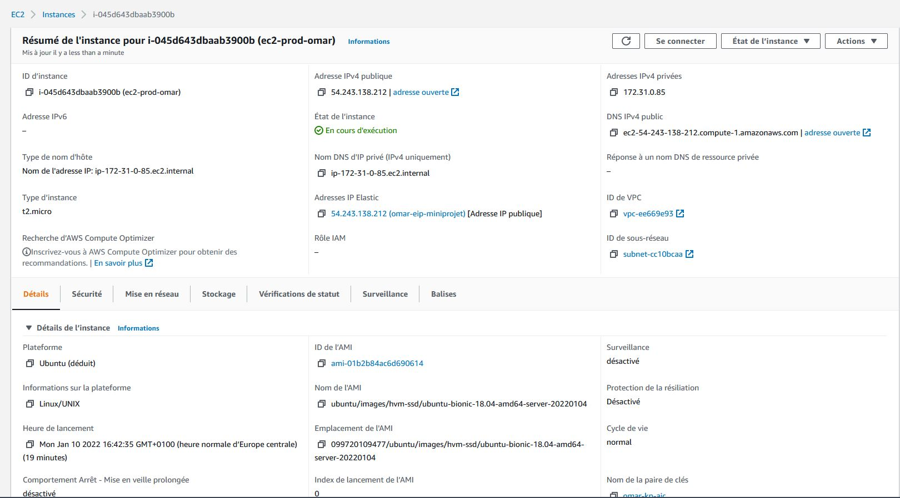
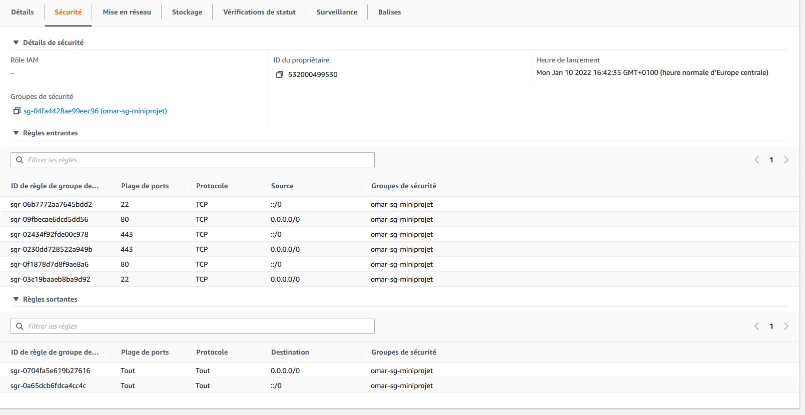
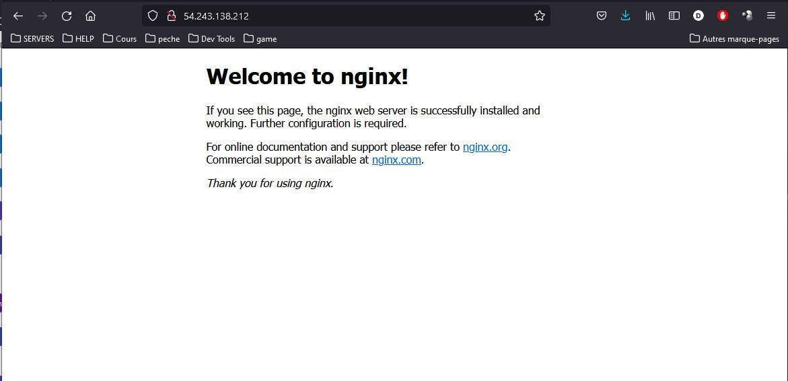

# COMPTE RENDU MINI PROJET TERRAFORM (omar BENNANI)

Dans mon cas, je préfère réaliser le travail étape par étape avant de tout intégrer :
* Module sg
* Module eip
* Module ebs
* Module ec2

On va variabiliser au maximum 

## Mise en place du sécurité groupe
* on peut :
    * variable : surcharger le nom du sécurity group
    * output : récupérer le nom de notre sécurity group qui sera attaché a l'instance EC2
#### ***`modules/sg/sg.tf`***
```javascript
resource "aws_security_group" "web-sg" {
  name = var.sg_name
  description = "Allow inbound traffic with port 22 & 80 & 443"

  ingress {
    from_port   = 22
    to_port     = 22
    protocol    = "tcp"
    cidr_blocks = ["0.0.0.0/0"]
    ipv6_cidr_blocks = ["::/0"]
  }

  ingress {
    from_port   = 80
    to_port     = 80
    protocol    = "tcp"
    cidr_blocks = ["0.0.0.0/0"]
    ipv6_cidr_blocks = ["::/0"]
  }

  ingress {
    from_port   = 443
    to_port     = 443
    protocol    = "tcp"
    cidr_blocks = ["0.0.0.0/0"]
    ipv6_cidr_blocks = ["::/0"]
  }

  egress {
    from_port        = 0
    to_port          = 0
    protocol         = "-1"
    cidr_blocks      = ["0.0.0.0/0"]
    ipv6_cidr_blocks = ["::/0"]
  }
}
```
#### ***`modules/sg/variables.tf`***
```javascript
variable "sg_name" {
  default = "omar-sg-web"
}

output "sg_name" {
  value = aws_security_group.web-sg.name
}
```

## Mise en place de l'IP elastique
* variable : le nom du tag de notre ip elastique
* output : 
    * eip_id: id de notre ip elastique qui sera utilisé pour l'association avec l'instance EC2
    * eip_ip : ip elastique que l'on fournira à la variable static_ip de notre instance EC2
#### ***`modules/eip/eip.tf`***
```javascript
resource "aws_eip" "ec2_EIP" {
  vpc      = true

  tags = {
    Name      = var.eip_tag_name
    formation = "Frazer"
    iac       = "terraform"
  }
}
```
#### ***`modules/eip/variables.tf`***
```javascript
variable "eip_tag_name" {
  default = "omar-eip-web"
}

output "eip_id" {
  value = aws_eip.ec2_EIP.id
}

output "eip_ip" {
  value = aws_eip.ec2_EIP.public_ip
}
```

## Mise en place de l'EBS volume
* variables : 
    * ebs_size : taille du disque dur en Go 
    * tag_name : nom du TAG
    * zone de disponibilité : il faut qu'il soit le même que celui de notre EC2
* output : id du notre ebs volume qui sera utilisé pour l'association avec notre EC2
#### ***`modules/ebs/ebs.tf`***
```javascript
resource "aws_ebs_volume" "ec2_EBS" {
  availability_zone = var.zone_disponibilite
  size              = var.ebs_size

  tags = {
    Name = var.ebs_tag_name
    formation = "Frazer"
    iac       = "terraform"
  }
}
```
#### ***`modules/ebs/variables.tf`***
```javascript
variable "ebs_tag_name" {
  default = "omar-ebs-web"
}

variable "zone_disponibilite" {
  default = "us-east-1x"
}

variable "ebs_size" {
  default = 10
}

output "ebs_id" {
  value = aws_ebs_volume.ec2_EBS.id
}
```

## Mise en place de l'EC2
* variables :
    * ami : l'id de l'image à utiliser
    * instance_type : type d'instance t2.micro/t2.medium ...
    * zone_disponibilité : il faut que ca soit la même que celle de notre EBS
    * key_name : nom de la clé privée enregistrée sur AWS
    * sg_name : nom du groupe de sécurité
    * username : nom utilisateur pour l'instance (ubuntu/centos)
    * private_key_path : emplacement du fichier private_key pour la connexion ssh
    * env : environnement (prod/dev) optionnel ici
    * static_ip : ip static que l'on va récupérer depuis notre IP elastique (depuis sont output) car l'association entre l'EC2 et l'EIP ne se fera que plus tard, et c'est cette valeur qui sera mise dans le fichier "ip_ec2.txt"
* output : ec2_id id de notre instance
#### ***`modules/ec2/ec2.tf`***
```javascript
resource "aws_instance" "myec2" {
  ami             = var.ami
  instance_type   = var.instance_type
  key_name        = var.key_name
  security_groups = [var.sg_name]
  availability_zone = var.zone_disponibilite
  
  tags = {
    Name      = "ec2-${var.env}-omar"
    formation = "Frazer"
    iac       = "terraform"
  }

  provisioner "remote-exec" {
      inline = [
        "sudo apt-get update -y",
        "sudo apt-get install nginx -y",
        "sudo systemctl enable nginx",
        "sudo systemctl start nginx"
      ]

      connection {
          type = "ssh"
          user = var.username
          private_key = file("${var.private_key_path}")
          host = self.public_ip
      }
  }
  
  provisioner "local-exec" {
      command = "echo IP public par défaut :${self.public_ip} - IP static depuis EIP :${var.static_ip} >> ip_ec2.txt"
  }

}
```
#### ***`modules/ec2/variables.tf`***
```javascript
variable "ami" {
  default = "ami-04505e74c0741db8d"
  type    = string
}

variable "instance_type" {
  default = "t2.micro"
}

variable "zone_disponibilite" {
  default = "us-east-1x"
}

variable "key_name" {
    default = "omar-kp-ajc"
}

variable "sg_name" {
  default = "omar-sg-web"
}

variable "username"{
    default = "ubuntu"
}

variable "env" {
  default = "prod"
}

variable "private_key_path" {
  default = "D:/Formation/AJC/05.DevOps/omar-kp-ajc.pem"
}

variable "static_ip" {
  default = "0.0.0.0"
}

output "ec2_id" {
  value = aws_instance.myec2.id
}
```

## Le projet App qui consomme tous les modules
#### ***`app/data_ami.tf`***
```javascript
data "aws_ami" "app_ami" {
  most_recent = true
  owners      = ["099720109477"]
  
  filter {
    name   = "name"
    values = ["ubuntu/images/hvm-ssd/ubuntu-bionic*"]
  }
}
```
#### ***`app/provider.tf`***
```javascript
provider "aws" {
  region     = "us-east-1"
  shared_credentials_file = "D:/Formation/AJC/05.DevOps/10-TERRAFORM/.aws/credentials"
}
```
#### ***`app/main.tf`***
```javascript
module "deploy_sg" {
  source = "../modules/sg"
  sg_name = "omar-sg-miniprojet"
}

module "deploy_eip" {
  source = "../modules/eip"
  eip_tag_name = "omar-eip-miniprojet"
}

module "deploy_ebs" {
  source = "../modules/ebs"
  ebs_tag_name = "omar-ebs-miniprojet"
  zone_disponibilite = "us-east-1a"
  ebs_size = 1
}

module "deploy_ec2" {
  source = "../modules/ec2"
  ami = data.aws_ami.app_ami.id
  instance_type = "t2.micro"
  key_name = "omar-kp-ajc"
  private_key_path = "D:/Formation/AJC/05.DevOps/omar-kp-ajc.pem"
  username = "ubuntu"
  env = "prod"
  zone_disponibilite = "us-east-1a"
  sg_name = module.deploy_sg.sg_name
  static_ip = module.deploy_eip.eip_ip
  
}

resource "aws_volume_attachment" "ebs_att" {
  device_name = "/dev/sdh"
  volume_id   = module.deploy_ebs.ebs_id
  instance_id = module.deploy_ec2.ec2_id
}


resource "aws_eip_association" "eip_assoc" {
  instance_id   = module.deploy_ec2.ec2_id
  allocation_id = module.deploy_eip.eip_id
}
```
* Vérifications :
    * fichier ip_ec2.txt contient 2 valeurs
        * IP par défaut dynamique, fourni par aws lors de l'initialisation :44.195.0.208
        * IP qui sera par la suite attachée a cette instance :54.243.138.212 
    * instance attaché à une EIP
    * image utilisée est la bonne (bionic)
    
<br>
* Vérification du sécurity group

<br>
* Vérification de l'ajout de l'ELB

<br>
* Vérification de nginx sur l'ip elastique obtenue

<br>

